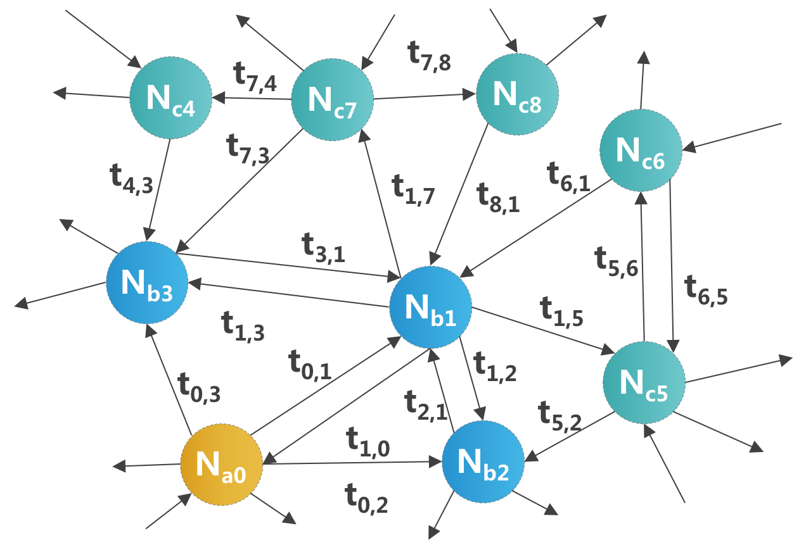
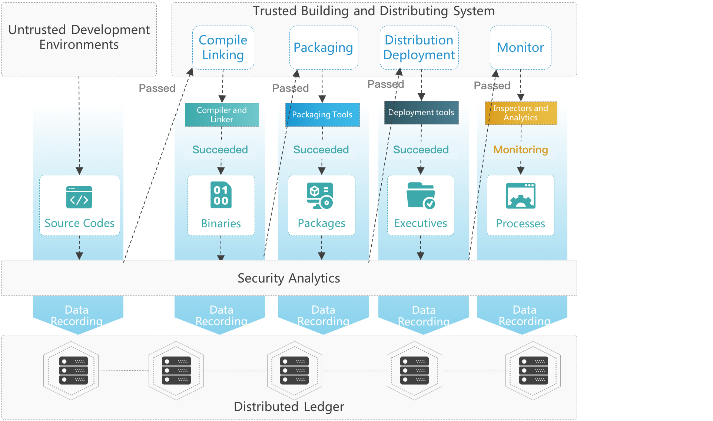

# Trias: Rooting Trust in Machines with a Consensus-Oriented Computing Infrastructure

###2018-7-23

## v1.0       

<!-- TOC -->

- [1. Introduction](#1-introduction)
- [2. Leviatom](#2-leviatom)
    - [2.1.Design](#21design)
    - [2.2.HCGraph](#22hcgraph)
    - [2.3.Features](#23features)
- [3. Prometh](#3-prometh)
- [4. MagCarta](#4-magcarta)
- [5. Token Economy](#5-token-economy)
- [6. Team and Partners](#6-team-and-partners)
    - [6.1.Founding Team Members](#61founding-team-members)
    - [6.2.Core Partners](#62core-partners)
- [7. Road Maps](#7-road-maps)
- [8. Published Papers](#8-published-papers)

<!-- /TOC -->
# 1. Introduction
The IAS Machine, born in the 1950s, represents a new height of human intelligence. Its Von Neumann Architecture has also become the cornerstone of contemporary information technology. With the past 60 years’ rapid advancement, especially with the breakthroughs in Cloud Computing, Big Data, IoTs, and AI technologies in last 10 years, IAS will be evolving to its new form: Intelligent Autonomous Systems. The new IAS machine will become an indispensable infrastructure for human society, especially when they are carrying our daily life. Consequently, the crisis in lacking trust to them will seriously affect our society’s stability. Trusting machines will become a new fundamental need for humanity in the near future. Building the Trustworthy and Reliable IAS (TRIAS) will be the ultimate goal of project Trias.

The risks of relying on untrusted machines have become significant. However, for the most of time, we trust the machines by default: 

- Computers and the Internet significantly boost the efficiency of our work. However, untrusted applications can lead to data leaking or tampering;

- Mobile phones meet our basic daily communication and entertainment needs. However, untrusted mobile apps are illegally collecting our personal data and infringing our personal privacy;

- Smart medical machines identify pathology, diagnose serious illnesses, and perform surgery with robotic arms. However, untrusted analysis and control-procedures will lead to privacy leaking and may even threaten patients’ lives;

- Smart home products play the role of housekeepers, cleaners, chefs, or pets, etc. However, untrusted systems will help intruders to peep or control our lives;

- Wearables, industrial intelligence, transportation infrastructures, and smart city infrastructures will also be machine-controlled. Untrusted systems will put our society in chaos.

Apple’s ecosystem sets a good example of implementing relatively trustworthy and reliable hardware and software systems. Apple employs secure hardware to strictly control the bootloading process of its operating system and applications. Apple devices’ operating systems are close-sourced and enforced with strict security checks. For third-party developed and maintained applications, Apple enforces a very centralized way to control the kinds of software to run on its platforms. All applications must be certified and tested by the AppStore. They are also required to develop in Apple’s programming language and implement their strictly controlled APIs. In this way, Apple mandates most critical aspects to provide customers with a secure and closed ecosystem. 

The centralised controls empower Apple with the capability to govern most details of its ecosystem, but this has also created a super power who has become the ultimate dictator. Customers could only obey and believe unconditionally that their devices’ manufacturer, Apple in this case, has no intention to “do evil”.

With the development of the blockchain technologies, the decentralized computation and communication paradigm have raised a wide-range of attentions. Particularly, its second-generation, represented by the Ethereum, aiming at creating a trustworthy world-computer with a decentralized paradigm. With high-level computation redundancy and high-degree algorithmically complexity, consensus protocols ensure a piece of smart contract’s correct execution, as it would be arithmetically difficult for attackers to take control of sufficient redundant executing environments and challenge the algorithm’s complexity. On the other hand, the smart contracts are open source scripts and usually only implement very simple semantics. Therefore, their correctness is not difficult to examine. 

Smart contracts pioneered a way to genuinely execute trustworthy applications. However, implementing general-purpose applications on common computation platforms, such as PCs, mobile, or IoT device, as smart contracts is a non-trivial task. Critical challenges should be considered:

- **Inefficient Consensus.** Reaching consensus is a high-cost task. PoW requires substantial computing powers, which is consumed by inconsequent workloads.

- **Heavy Redundancy.** Blockchain platform implements undeniable smart contracts operations by enforcing high redundancy. It will result in serious computation waste and network congestion, hence seriously limiting the number of programs to run in parallel.

- **Restrictive Interface.** Though many smart-contracts are Turing-complete, the functional library is far from enough. It will be extremely complex to implement the native applications’ service logic with the existing smart-contract APIs.

- **Reconstruction and Migration.** As a brand-new programming paradigm, it would be extremely complex to migrate existing native applications to the smart contract platform. Re-implementing all the existing software on this new platform is laborious, if even possible, given the restrictive interface stated above.

- **Trustworthy Data Collection.** The trustworthiness of the data collection procedure is critical to a blockchain-based system, as it would be meaningless to protect the integrity of tampered data. Human factors should be avoided as much as possible, but untrusted data collection application is also destructive.

- **Data Privacy Preservation.** Blockchain is not designed to preserve privacy. In contrary, it ensures integrity by a high-degree of openness. Therefore, enforcing privacy preserving computation on blockchains is a particular challenging task.

Trias’s vision is to build a trustworthy and reliable general-purpose computation infrastructure, where any system and software implement only expected behaviours. With Trias, we can root trust into machines with a firm assurance that the machines will deterministically “do what they are told to do”. Trias builds an all-platform-supported native-application-compatible smart contract execution platform, development framework and collaborating ecosystem. It has three subsystems:

**Leviatom, a network of Trusted Execution Environments (TEEs) to achieve correct executions of general-purpose software.** Leviatom implements a Heterogeneous Consensus Graph (HCGraph) algorithm, which combines heterogeneous TEE technologies (TPM, TXT, Intel SGX, ARM TrustZone, etc.) and graph computing algorithms (similar to Hashgraph or DAGs). Heterogeneous TEEs allow Leviatom to identified misbehaving nodes rapidly while eliminating the dependency on any single technology’s provider, e.g. Intel SGX-based consensus requires a strong dependency on Intel’s centralised online verification service. Meanwhile, HCGraph’s gossip protocols significantly reduces the redundant TEE verifications, while preserving a scalable and robust web-of-trust.

**Prometh, a traceable development framework to achieve decentralised functional and security properties definitions for general-purpose software.** Prometh genuinely records the critical information for a piece of software’s entire lifecycle on blockchain, including development, building, distributing etc. It further motivates the community to apply DevSecOps methodologies to enforce automatic or manual examinations or verifications on the recorded information for each critical step. This deduces the genuine properties of the software, which ensures any software to only implement intended behaviours. 

**MagCarta, a consensus-oriented programming paradigm to achieve embed and self-defined consensus strategy for high-order enterprise DApps.** MagCarta contract implements invocations to the Prometh applications. It schedules the Prometh applications on Leviatom computing network to achieve high-order enterprise application logic. It also enforces self-defined consensus algorithm to determine the correctness of each invocations. With MagCarta, DApps can implement their own embed consensus strategy and ledger structure. They can also program their strategy to reward the computing infrastructures (Leviatom) or software components (Prometh) contributors.

Trias’s three subsystems implement a Separation-of-Powers model (Trias Politica). Sepearation-of-Powers is a political theory for social governance. It advocates that the powers of execution, legislation and judiciary should be controlled by different organisations. They exercise independently and restrict each other. In Trias, Leviatom is responsible for execution, which executes a sequence of programs; Prometh is responsible for legislation, which defines each program’s functional and security properties; MagCarta is responsible for judiciary, which determines the service quality and allocates all parties’ interests. 

With the separation of powers, Trias further implements the Check-and-Balance, so that the combination of any two powers can limit the excessive expansion of the third one. The properties of the software stack that implements Leviatom protocols are defined by Prometh, and MagCarta identifies and justifies the contributions of Leviatom nodes; Prometh's own software stacks are executed on Leviatom, while MagCarta identifies and justifies the contributions of Prometh attribute-definers; MagCarta contracts’ attributes are defined by Prometh, and MagCarta virtual machine is executed by Leviatom trusted computing network.

Trias, for the first time, proposes a Separation-of-Powers-based decentralization model for the cyberspace governance. Between the fully decentralized and fully centralized governance structures, Trias disintegrates the monopoly powers of the machines’ manufacturer, while dynamically balancing the three governance powers with mutual-restrictions. It creates a new order in the decentralisation governance paradigm, aiming at forwarding one step closer to the fairness and justice in the cyberspace.

Trias aims at enabling a much wider range of usage scenarios, as it targets at bringing trust to general-purpose software platforms instead of only to the ledger-related applications: 

1. **Layer -1 enhancement to public blockchains.** Leviatom establishes trusted relationships among the consensus nodes of existing public chains. This pre-exist trusted relationships significantly reduces the complexity for reaching consensus. It is able to help the third-party chains to achieve more than 100,000 tps for a single shard and defend near 90% malicious collaborative attacks.

2. **Consensus-Oriented Enterprise Programming.** MagCarta allows DApps to delegates complex business logic and data collection procedure as trusted native applications. It further implements the consensus logic and ledger format without confining to any predefined fixed strategies by the chosen any underlying public blockchain. Consensus-Oriented programming allows DApps on Trias to implement much more complex general-purpose enterprise application logics; 

3. **Trusted operating systems and application ecosystem.** Trias eliminates easily malware and attacks, as Leviatom only allows the executions of white-listed applications and Prometh only allows the applications to implement white-listed behaviours; Therefore, Trias builds trustworthy Appstores for PCs, enterprise servers, mobile or IoT devices;

4. **Trustworthy Multi-Party Computation.** Trias achieves multi-party computations by exchanging applications instead of exchanging private data. Leviatom ensures the genuine executions of the third-party application, and Prometh enforces the application to implement predefined data processing contracts;

5. **Trustworthy Cloud Computing Platform.** Leviatom creates a union of trusted computing platforms, which can act as a global-scale cloud computing platform. Prometh implements the development framework and application distribution channel (or the Appstore) for this cloud platform, and MagCarta implements the SaaS logic to connect and schedule the Prometh apps. This ubiquitous cloud platform links the small public clouds around the world, who do not have enough scale to convince more customers. Trias provides them with trustworthiness endorsement, and further implements a cross-border unified resource sharing, scheduling and billing.

# 2. Leviatom
## 2.1.Design
Most consensus algorithms are blamed for their inefficiency. It is mainly caused by the fact that any single block of transactions requires a consensus to be reached among a huge number of “stranger” voting nodes. As the voting nodes do not have pre-exist trust relationship, any consensus is in fact a trust building process from scratch for an extensive large amount of entities. This incurs significant network latency and computation complexity. 

Instead of layering consensus acceleration techniques above the consensus layer, such as the Layer 1 or Layer 2 improvements, Leviatom targets at the performance issues by digging 1 layer “below” the consensus layer: a Layer -1 enhancement. Layer -1 focuses at constructing trust relationship among the voting nodes. Its main goal is to identify the set of nodes who possess the greatest difficulties to “tell a lie”, i.e. the difficulties to execute unexpected programs without being identified. 

With the trustworthiness of the voting nodes modelled and calculated, the consensus layer will no longer need any one particular transaction be examined by all nodes, but only by the nodes whose trustworthiness are endorsed by most other nodes. As less nodes are required to vote, the consensus will reach much faster. As any voting node is endorsed by a large number of other nodes, the difficulty in breaching the consensus still remains high.

One way to implement the Layer -1 enhancement is to enforce remote attestation techniques among the voting nodes. Remote attestation is a critical procedure implemented by the Trusted Execution Environment (TEE) technologies. It genuinely reports the status of the loaded applications on a target node with the help from an embedded security chip, such as the TPM (Trusted Platform Module), the Intel CPU’s SGX extension, or the ARM’s TrustZone extensions. With remote attestations, any voting node will examine whether its connecting peer is running only the correctly installed and configured software stack. Therefore, as long as any node has the intention to “tell a lie”, it will be identified immediately, because the changed applications or configurations will be spotted by remote attestations. With the Layer -1 enhancement, a voting node will ensure that it is communicating with a correct peer. 

However, one critical difficulty in applying the TEE technologies is to effectively manage the scale of redundant attestations. Remote attestations only ensure the target node’s confirmation of expected behaviours up to the time when the attestations are taken. Therefore, a target voting node is required to get attested frequently. For a large network of nodes, frequent attestations among communicating nodes may incur significant computation and networking overheads, as the complexity for maintaining the mutual attestation relationship among n nodes is exponential O(n2).

Leviatom solves this issue by introducing the transitive trust relationship. Transitive trust allows one node to deduce the trustworthiness of a remote node without initiating direct remote attestations: as long as there exists an iterative attestation path to the target node. Therefore, in a network of partially mutual attesting nodes, as long as a node has the largest number of attestation paths led to it, it is regarded the hardest one to “tell a lie”. 

To further accelerate this path-finding procedure, the mathematical multifaction operation is applied iteratively on this transitive trust relationship matrix. This process will final construct a matrix, with each value representing the “Conspiracy Breaching” for each associated node. It indicates the number of nodes a target malicious node has to “bribe” in order to “tell a lie”. 

With this matrix defined, Leviatom only need to choose a small number of nodes with the highest values as the voting node to enforce the consensus procedure on a target transaction. This procedure significantly increases the consensus efficiency. Meanwhile, when each node’s “Conspiracy Breaching” remains high, the consensus still remains hard to breach. 

Leviatom can further implement a trustworthy node selection mechanism to support the upper layer service, such as the consensus layer services of third-party public blockchains, in which case the public chains run as a Dapp on Leviatom’s Layer -1 network. More importantly, it supports the MagCarta smart contract’s “consensus” call, which distributes Prometh Applications on the chosen Levaitom nodes. This will be discussed in Chapter 3 and 4. Leviatom’s core algorithm is called the Heterogeneous Consensus Graph (HCGraph), which is described and evaluated in the following sections.

## 2.2.HCGraph
HCGraph is backed by Trias founding team’s research in the System Security group at University of Oxford since 2011 [1,2,3]. It integrates Heterogeneous TEE technologies (Trusted Execution Environment, includes Intel SGX, Intel TXT, ARM TrustZone, TCG TPM, etc.) and graph computation algorithms to achieve fast attestations among a large-scale network of distributed nodes. 

The basic idea of the HCGraph is to enforce mutual attestations and gossip protocols among nodes, so that they collaboratively construct a web-of-trust, i.e. the Leviatom Network. The connections among each node on the web represent the nodes’ mutual attestation relationship. The strength of the connections is modelled to reflect the intensity of their mutual-attestations. This intensity represents how often a node’s integrity is examined by its peer. Therefore, by tracing the connections and evaluating the strength values, a node is able to deduce the integrity of another without performing direct attestation to it. 

<div align=center>
  
</div>

The above figure depicts the Leviatom’s conceptual model. A node attests the integrity of other nodes. It collects the attestation results, which are modelled as its Direct Trust to a target node and is stored in its local database, the Kernel. The direct trust is defined as follows:

<div align=center>
  
</div>
 
Di,j(t) is calculated by combining the timestamps maintained in the attestation history, which records the attestation tickets towards the neighbour (Nj). It is an integer interpreted as a bitmap vector with the length of k. Each bit represents a timestamp one step away from its higher adjacent bit, and the highest bit indicates the time t. A bit is set to 1 when an attestation is performed at the step it stands for. Thus, the direct trust, calculated as above, reflects all the recent successful attestations up to time t. AHj(t) denotes the attestation history for node Nj at time t. As a step is defined as minimum attestation interval, different timestamps t in AH do not indicate a same bit index. We can thus safely use summation instead of bitwise OR (“|”) for setting the corresponding bits. 

This definition allows two evaluation values be compared. The larger one indicates the more recent an attestation is performed, and hence indicates a higher trust credibility. This property is used for modelling the Transitive Trust. 

Direct trust values are propagated among the logical surrounding neighbours by exchanging the corresponding kernel contents using the gossip protocols. Therefore, from the kernel, a node is able to determine how its neighbours attest to each other. This thus helps modelling the Transitive Trust, which is represented by a path of connections.

The gossip protocols allow each node to disseminate the trust relationship it gathers to other related nodes, so that redundant attestations will be reduced. There are three ways of gossip disseminations in the Leviatom Network: 

1) gossip about gossip: when the local node and a target node only have few common in their Kernels, the gossip about gossip protocol is initiated to directly exchange their Kernels. 

2) gossip about reduced gossip; when the local node and a target node have much common in their Kernels, the gossip about reduced gossip protocol is initiated to only exchanged the complemental parts. 

3) Targeted gossip; any time when a local node updates its Kernel, it identifies the set of target nodes who will be benefit from the updated data and sends the updated data package directly to the set of nodes.

Gossip about gossip enforces batched exchanges of attestation relationship data, this allows a new node to quickly obtain the up-to-date global data. Reduced gossip allows two “not-too-closed” nodes to exchange their data in batches, while reducing networking overheads. Targeted gossip allows new attestation relationship information to quickly propagate among the “closely-related” nodes to without putting too much burden on the network traffic. 

The combination of these three gossip strategies achieves both quick information propagation rate with low networking overheads. With transitive trust relationship gathered by remote attestations and gossip protocols, HCGraph further builds a‘Conspiracy Breaching’ model for nodes to illustrate how intense a target node is attested by other nodes. This model helps locating the nodes who have the greatest ‘difficulties to lie’. Meanwhile, small world network algorithm improves the networks’ robustness. 

Detailed algorithms and evaluations can be found in [1,2,3], and more experiment results will be published in the technical whitepaper.

## 2.3.Features
- **Efficient Consensus（>100,000 TPS in one shard）：** Trias rapidly locates the most trustworthy nodes to enforce the consensus logic. This allows only a small set up node to participate in making consensus, and therefore significantly increase consensus speed;

- **High Stability（Resistant to near 90% malicious collaborative）：**  Based on HCGraph, Trias builds a small-world network between nodes. This network ensures that even if 90% nodes are removed from the network, it is still connected, which means there still exist at least an attestation path between any two remaining nodes; 

- **TEE-based Graph Computation：** HCGraph’s gossip protocols facilitates a small world network among the attesting nodes. It significantly increases any single consensus code’s cost to “lie”, and effectively reduces redundant calls to TEE capabilities. This will greatly increase the consensus efficiency while defending against high-degree malicious collusive. 

- **Heterogeneous TEE Technology：** A single TEE technology would be centralized controlled by technology providers. For example, Intel SGX has a strong dependency on Intel’s centralised on-line verification service. HCGraph supports the attestations among different TEE technologies and creates a web-of-trust to constrain any single type of TEE-based system’s behaviour. It thus eliminates the single-point-of-failure in TEE technology.

- **Heterogeneous TEE hosts：** Remote attestation protocols cannot identify hardware attacks against TEE. This provides an opportunity for malicious-mining nodes to destroy the network by attacking their one TEE hardware. HCGraph considers the heterogeneity of the selected nodes' environmental characteristics, such as physical locations, affiliations etc. This will greatly increase the difficulties for malicious organisations to destroy all participating consensus nodes’s TEE hardware.

- **Optimized Gossip Protocol：** HCGraph utilizes a gossip about gossip protocol similar to the HashGraph to achieve efficient trustworthiness propagation. HCGraph further introduces gossip about reduced gossip and targeted Gossip to optimize the transfer traffic.

- **Dynamic Election Based on Trust Relationship：** HCGraph constructs the global ‘Conspiracy Breaching’ model according to the trust relationship among mutually attesting node. This embodies a real-time coded node selection in accordance to the nodes’ past behaviours. It eliminates the human factors as in the DPOS, while preserving high throughput and low latency.

# 3. Prometh
Two critical challenges arise when we interact with a software system: whether the software implements correct behaviours, and whether the software’s behaviours are correctly enforced. The second challenge is addressed by the Leviatom Network, which identifies and immediately eliminates the nodes who execute the wrong software or load the wrong components to support the given software. Leviatom also provides the “Conspiracy Breaching” value to indicate the trustworthiness of the selected node. This gives the MarCarta Contract a reference for determining the consensus strategy.

The first challenge is addressed by the Prometh framework. It aims at identifying the fault behaviours embed inside the software itself. To ensure a piece of software to only carry expected behaviours, all the procedures of its full lifecycle should be considered. Especially the most critical ones as:

1. During development, the source codes of the target software may be tampered with to include malicious behaviours. Backdoor codes might be inserted into the source codes and remain hidden. Unintended or deliberately software bugs may also exist, which will result in targeted 0-day exploits to get instantiated;

2. During building and packaging procedures, malicious binary codes may be injected into the correctly compiled object files. This might be caused by a fault complier which generates malicious codes. It might also be caused by a fault linker which substitutes the correct object files with malicious ones. The host operating system might also substitute the object files at the filesystem level.

3. During the delivery and installation, the binary codes of the target software might be substituted or patched with malicious codes. This might occur during the transmission of the software package. During installation, the extracted binary codes or configuration files might also be changed maliciously.

Prometh solves the software security issues by firstly recording the critical information (or its undeniable identification) of all the critical steps of a software’s full life-cycle on a distributed ledger. It then encourages a community to iteratively evaluate whether each step is correctly executed. Security verification methods will also be enforced on the artefacts produced by each procedure, such as the source codes, object files, binary files, package files, etc. These methods will iteratively dig the security and functional implications from the artefacts, generating a clearer profile for a target application. The following figure depicts the general procedures:

<div align=center>
  
</div>
 
The trusted building process starts when the developers pushed source codes to the repositories. Even though the development environment is untrusted, the integrity of the entire process is not affected, as the resulting source codes are easily audited and verified. Once the source codes are pushed, their identification data will be recorded on the distributed ledger. The security analytics procedure, running on Leviatom, will be triggered to fetch the source codes and run the verifications. Once the verification passes, the results are stored on the ledger, and the next procedure is triggered. The resulting identifications of the binary codes are pushed to the ledger, and the analytics process are invoked to examine the integrity of the compiling and linking procedures. 

With this iterative procedure, Prometh ultimately creates a decentralised traceable software lifecycle, which allows users to interrogate the origin of any piece of software and examine their functional and security implications. Prometh’s core is a Trusted Building System (TBS) which implements a set of trusted transformation process. Its design and implementation are backed by Trias founding team’s research in the System Security group at Peking University since 2009 [4,5,6]. 

More details in design and implementations of Prometh and the TBS will be illustrated in a dedicated technical whitepaper.

# 4. MagCarta
MagCarta is a Turing Complete smart contract description language. MagCarta schedules and coordinates Prometh applications on the Leviatom network. MagCarta can be roughly regarded as a Bash script in Linux environment, which implements the most basic program logic and further invokes other Linux programs for more complex functionalities. Moreover, MagCarta distributes rewards to programs, computations and data providers. 
Each MagCarta smart contract is defined by a set of declarations, which specifies the compute, programs, and data that will be referenced by the smart contract codes. Transactions are also defined to represent the input data for the contract.

``` 
{
CONTRACT: $CONTRACT_NAME,
COMPUTE_DECLARATION: {$COMPUTE_TYPE_1:$COMPUTE_NAME_1, …},
PROGRAM_DECLARATION: {$PROGRAM_TYPE_1:$PROGRAM_NAME_1, …},
DATA_DECLARATION: {$DATA_TYPE_1:$DATA_NAME_1, …},
TX_DECLARATION: {$TX_TYPE_1: $TX_NAME_1, $TX_TYPE_2: $TX_NAME_2, … },
CODE_BLOCK:{$CODE_BLOCK_PROPERTY_NAME_1: $CODE_BLOCK_PROPERTY_1, …},
…
}
```

The COMPUTE_DECLARATION specifies the kinds of Leviatom nodes to run the target application. Line 1 declares the name of the type of computes. Started from Line 2, a set of <KEY,VALUE> pairs specify the properties of the desired computes.

```
{
COMPUTE : $COMPUTE_NAME,
$PROPERTY_KEY: $PROPERTY_VALUE,
	…
}
```

A few $PROPERTY_KEY are defined to satisfy the most common usage scenarios.

**TRUST_VALUE** identifies the trustworthiness of the identified nodes. It is the basic value propagated by the Leviatom network. TRUST_VALUE represents the target node’s cost for implementing a“malicious collective”, i.e. the least number of other nodes that the target has to bribe in order to “tell a lie”. 

**SOFTWARE_STACK** specifies the desirable software to run on the identified nodes. This property help eliminating or selecting the particular nodes who are installed with target software applications. It allows the contract to further identify the security or functional properties of the target node’s execution environment. The values of this property are usually specified by the PROGRAM_DECLARATION, introduced next.

**DATA_STORE** specifies the data ownership of the target node. This property allows the contract to identify only the nodes possessing particular data. It is especially useful for the applications who need to access particular data, regardless of other properties of the target nodes. It allows MagCarta to schedule particular application to the node possessing the data, and achieve trusted local computation, instead of requiring the data own to share the data, in order to achieve multi-party computation. 

**PROGRAM_DECRALATION** identifies the target application to run on Leviatom nodes. Line 1 defines the name of the target type of applications. Started from Line 2, a set of <KEY,VALUE> pairs specify the properties of the desired programs.

```
{
PROGRAM: $PROGRAM_NAME,
$PROPERTY_KEY: $PROPERTY_VALUE,
	…
}
```

A few $PROPERTY_KEY are defined to satisfy the most common usage scenarios.

**ID** identified a unique name of the target program. This is the fastest way to locate an application from Prometh’s application store.

**VERIFIED_DESCRIPTION** defines the verification entities for the target application. This can be a set of <KEY, VALUE> pairs, specifying a particular property (identified by KEY) is automatically verified and signed by a third-party application (identified by VALUE). As the verification applications themselves need verification, the VALUE may reference to another PROGRAME_DECLARATION. This referencing process may iterate until a minimum set of software building tools are identified. For the correctness of these tools, formal verifications are applied.

**DATA_DECRALATION** identifies the properties of the target data to be possessed by the target node. Line 1 defines the name of the target type of data. Started from Line 2, a set of <KEY,VALUE> pairs specify the properties of the desired dataset.

```
{
DATA: $DATA_NAME,
$PROPERTY_KEY: $PROPERTY_VALUE,
	…
}
```

**ID** identified a unique name of the target program. This is the fastest way to locate an application from Prometh’s application store.

**VERIFIED_DESCRIPTION** defines the verification entities for the target data. This can be a set of <KEY, VALUE> pairs, specifying a particular property (identified by KEY) is automatically verified and signed by a third-party application (identified by VALUE). As the verification applications themselves need verification, the VALUE may reference to another PROGRAME_DECLARATION. This referencing process may iterate until a minimum set of software building tools are identified. For the correctness of these tools, formal verifications are applied.

**TX_DECLARATION** identifies the format of the transactions that the target contract can process. A transaction transmits the input value to a contract. In MagCarta, Leviatom nodes, Prometh applications, and dataset, can all be sent as transactions to a target contract.

```
{
TX: $TX_NAME,
COMPUTE: <$COMPUTE_NAME_1, … >,
PROGRAM: <$PROGRAM_NAME_1, …>,
DATA: < $DATA_NAME_1, …>,
…,
}
```

The core of MagCarta Smart Contract is a new operation: the consensus call. It initiates the Prometh program scheduling process among predefined Leviatom nodes. In MagCarta, the type of programs, the type of target nodes, and the type of strategy for reaching consensus and distributing rewards, can all be defined by developers. 

```
consensus(COMPUTE_SET, PROGRAM_SET, DATA_SET, STRATEGY_SET)
```

The consensus call will distribute the Prometh programs identified in the PROGRAM_SET parameter to the Leviatom nodes defined by the COMPUTE_SET parameter. The STRATEGY_SET allows developers to specify how the different copies of programs reach a consensus, and how to pay the Leviatom nodes and the Prometh application providers.

The consensus call allows MagCarta contract developers to delegate complex business logic to native applications running on general-purpose computing platforms, such as PCs, enterprise servers, mobile phones or IoT devices. For these delegated tasks, Prometh guarantees the genuine implementation of their behaviours, and Leviatom achieves the correct execution. The consensus call further implements the strategy for trusting the delegated executions’ results. 

Meanwhile, Prometh programs can also implement the data collection logic, with the trustworthy nodes selected by the Leviatom network, the data collector’s behaviours will be genuinely executed. This guarantees the trustworthiness of the data before they are submitted to the blockchain. More detailed designs and implementations will be given in a separated technical whitepaper. 

# 5. Token Economy

On Leviatom network, a node can choose to act in one or many in three roles: 

1) Verifiers, who continuously and repeatedly examining the trustworthiness of the surrounding nodes by initiating TEE-oriented verifications to them. They also carry the duty of node discovery. This repeatedly verifications constitute the basic heartbeat of Leviatom, and should be encouraged and rewareded. Leviatom thus implements the "verification as mining" mechanisms, so that the frequent verfication computing power contributors will be allocated tokens periodically.

2) Routers, who collect the verification data from the verifiers and disseminate it to other peers. Routers utilise the gossip algorithms to construct the web-of-trust and help determining the "Conspiracy Breaching" model for each node. Routers also help to identify the Leviatom nodes who have specified properties, such trust value, software properties, dat possessions, etc. Routers form the backbone of Leviatom network, they should also get rewarded with "routing as mining".

3) Executers, who execute the Prometh applications as scheduled by the MagCarta contract. The MagCarta's consensus call specifies how the executers will get rewarded, as long as its returned values satisfy the consensus strategy. Since the its execution rights are obtained by contributions in compute power, storages, or bandwidths from verifiers and routers, executers will have to reward these contributions with part of its earned tokens. This mechanism is call "execution as gas" and "verification as gas". 

Prometh applications also need the paticipation of the community for verifying the genuine behaviours of smart contracts or native general-purpose applications. This is achieved by implementing Prometh's component as MagCarta contracts, which ultimately specify the rewards for the selected Leviatom nodes, as long as the Prometh application's providers. Therefore, in the early stage of Prometh system, it is necessary to use the mining mechanism to motivate volunteers. Specifically, developers or security analysts can get mined Tokens when performing the Prometh's program testings and automated analysis of verifications for software source codes (or intermediate binary files).

On the other hand, Prometh can't guarantee complex native applications to have zero vulnerabilities. Its strong audit and trusted traceability system facilitate potential vulnerabilities be discovered and counteracted within a limited time. With this case, the Executors (i.e. Leviatom's third-layer computing power nodes) can convert partial rewards into insurance and deposit it into ghe insurance contracts. Insurance contract can reward security analysis programs that find program vulnerabilities in Prometh ecosystem. The insurance also compensates Leviatom nodes that get losses due to running potentially vulnerable Prometh programs. Therefore, insurance model can target at data or computing power providers. They can choose to convert partial rewards into insurance to compensate for the undiscovered security risks of local data or computing platforms. Tokens of insurance contracts can be used as rewards for vulnerabilities’ finders, thus building a virtuous circle of cyber-security ecosystem.

A more detailed Trias token system and economic model will be illustrated and published in a separated Token Economics White Paper.

# 6. Team and Partners
## 6.1.Founding Team Members
**RUAN, Anbang, CEO** Founder & CEO of Octa Innovations, Ph.D (Oxford), MSc (Peking University). Former Research Associate in Trusted Cloud from the Oxford e-Research Center (OeRC). More than 10-years research experience in Trusted Computing, Trusted Cloud Platform, Cloud Computing Security and Virtualized Platform Security. Led and attended several European research projects, funded by the EPSRC, FP7 and the Innovate UK. Served as the reviewer in Trusted Cloud for the Journal of ACM. 

**WEI, Ming，CTO**, Co-founder & CTO of Octa Innovations, Ph.D. and MSc (Peking University). Former China Aerospace Software R&D Center Senior Architect, Siemens Academy Engineer. Years of software development and management experience in cloud computing, AI, embedded projects, etc. In Octa Innovations, he hosted and developed DASO private chain and consortium blockchain, and continuous immune system’s security framework to solve the users’ data center security problems. It achieves 100,000 TPS data storage security applications’ scenario requirements. There are more than ten papers and patents.

**HAO, Shuang，CMO**, PR Director in Octa Innovations, Master of Media Management in HKBU. Former frontline reporter in national media for major international news. Worked in Tsinghua University and NetEase, led strategic communication and public affairs.

**SUN, Jiahao，CSO**, Chief AI Scientist of a well-known international bank located in London. Graduated from Oxford University, majored in Computer Science. The AI elite certified by the British government. He has founded several AI and Fintech companies in London, invested by top investment institutions in Europe. At the same time, he is also a gold lecturer of AI and deep learning in online courses on NetEase, XiniuEdu, and JulyEdu.

**YIN, Zhaoming，Leviatom Core Developer** Alibaba senior engineer of EB-class big data platform, Ph.D. in computer science from Georgia Institute of Technology, MSc. In PKU. He has many years’ experience of graph computations and distributed systems at Oracle and Intel Research Institute in the Silicon Valley. He has published several papers in magazines/conferences such as ACM SIGMOD, with Google scholar cited more than 170 articles.

**GUO, Lin，Prometh Core Developer** Operation and maintenance director in Octa Innovations. Used to work as a senior operation and maintenance engineer of Didi and led the team to automate the release and testing of DevOps on more than 100 business projects. Responsible for containerization design and implementation, as well as DEVOPS architecture. He has conducted in-depth research on service integrates with blockchain technologies such as BigchainDB, Ethereum, Hyperledger, and EOS.

**LI, Fei，Prometh Core Developer** Operation and maintenance director in Octa Innovations. Former system architect in Feixin, led the communication project of overseas RCS mobile internet, designed the system and storage framework of the O2O platform. Excelled in researching internet technology and making heterogeneous middleware environment. Handled over 6 million simultaneous online uses and million-level TPS.

**CHEN, Jian，Chinese Market Development** Marketing Director in Octa Innovations, used to worked for NetEase and 360, etc. 10 years of marketing experience, responsible for the marketing objections of NetEase games, Youdao search, Youdao dictionary and 360.

## 6.2.Core Partners
**Octa Innovations, Ltd., P.R.C.**

Octa Innovations will provide technical, research and marketing support for Trias. Its core members are mainly from Oxford University and Peking University, and top tech companies such as Microsoft, Alibaba, DiDi etc., with strong technical strength and years of business or technical development experience in information security-related fields. Octa Innovations is one of the earliest security solution providers to integrate trusted computing and blockchain technology in China. It has successfully completed many major projects in banking, securities, government affairs, etc., with excellent social and economic effects.

**The joint laboratory of Octa Innovations and Peking University (the Lab for short)**

The laboratory will rely on Octa Innovations to provide Trias with innovative research capabilities in TEE, graph computation, and trusted software construction. The laboratory is jointly built by the School of Software and Microelectronics in Peking University and Octa Innovations, aiming to achieve innovative R&D and industrial development of trusted technologies, as trusted computing, reputation systems, and blockchain, etc. Its research team includes 4 professors, 12 doctoral students, and more than 20 master students.

# 7. Road Maps
**2017 Q2**, At Cloud Computing and Big Data Security Forum of the Guiyang Big Data Expo 2017, Dr Anbang Ruan presented for the first time the heterogeneous consensus protocol, which integrates trusted computing, graph algorithm, and blockchain; 

**2017 Q3**, The joint innovative laboratory of Octa Innovations and Peking University was established. The design concept and technical route of the Heterogeneous Consensus Graph were firstly proposed; 

**2017 Q4**, Octa innovations launched its DASO framework, which implement the DevSecOps procedures on a private blockchain.

**2018 Q1**, Based on Prometh+Leviatom private chain, the development and maintenance system of enterprise data centre security was launched in securities and governments; 

**2018 Q1**, Feasibility analysis and planning for Trias;

**2018 Q2**, Project Startup and Team Buildup;

**2018 Q3**, Publishing Technical white paper. Finishing the major parts programming of Leviatom, including the of HCGraph protocl stack, Trusted Computing libraries, account management, wallets, block chain brower, etc.

**2018 Q4**, Testnet launches; 

**2019 Q1**, Test & Iteration; 

**2019 Q2**, Mainnet v1.0 launches. 

# 8. Published Papers
Leviatom：

**[1] RepCloud: Attesting to Cloud Service Dependency**

**Anbang Ruan** and Andrew Martin. In IEEE Transactions on Services Computing
	
**[2] NeuronVisor: Defining a Fine-grained Cloud Root-of-Trust**

**Anbang Ruan** and Andrew Martin. In Proceedings of The 6th International Conference on Trustworthy Systems (InTrust 2014). Dec, 2014.

**[3] RepCloud: Achieving Fine-grained Cloud TCB Attestation with Reputation Systems**

**Anbang Ruan**, Andrew Martin. Proceeding of STC’11 The Sixth ACM Workshop on Scalable Trusted Computing. Chicago, IL, USA, Oct. 2011.

Prometh：

**[4] Towards a Source-Code Oriented Attestation**

**Anbang Ruan**, Qingni Shen, Liang Gu, Li Wang, Yahui Yang, Zhong Chen, China Communications, Nov. 2009. Vol.6 No.4, pp: 82-87. SCI-Indexed.

**[5] SCOBA: source code based attestation on custom software**

Liang Gu, Yao Guo, **Anbang Ruan**, Qingni Shen, Hong Mei. In Proceedings of ACSAC 2010: Austin, Texas, USA

**[6] Practical Property-based Attestation on Free Software**

Liang Gu, **Anbang Ruan**, Yao Guo, Qingni Shen, Xiangqun Chen. Poster session of ACSAC’09, Nov 2009.

Trias：

**[7] A Separation-of-Powers Model for a Trustworthy and Open Cloud Computing Ecosystem**

**Anbang Ruan**. Dphil (PhD) Thesis at University of Oxford.

**[8] Breaking Down the Monarchy: Achieving Trustworthy and Open Cloud Ecosystem Governance with Separation-of-Powers**

**Anbang Ruan**, Ming Wei, Andrew P. Martin, David Blundell, David Wallom. In Proceeding of IEEE CLOUD 2016. San Francisco, CA, USA

**[9] On the Feasibility of an Open-Implementation Cloud Infrastructure: A Game Theoretic Analysis**

Charles A. Kamhoua, **Anbang Ruan**, Andrew P. Martin, Kevin A. Kwiat. UCC 2015: Limassol, Cyprus

