# 1.	TRIAS：可信赖的智能机器

## 1.1.	相信机器，人类新的基础需求

自图灵测试被提出，我们对机器模仿自己、进而帮助自己的期待从未停止。上世纪50年代诞生第一台计算机IAS机（Institute of Advanced Study Machine）代表了人类智慧的新高峰。其所实现的冯诺伊曼架构也成为了当代信息社会的奠基石。随着过去60年信息技术的突飞猛进，尤其是近10年云计算、大数据、物联网与人工智能技术领域的突破性进展，IAS将被重新定义：智能自主计算设备（Intelligent Autonomous Systems），或被称为智能机器。   

随着人工智能技术的发展，新型的IAS将很有可能成为人类生活不可或缺的基础设施。我们能够依赖各种“拟人”的智能机器，生活更加便捷，劳动力得以解放。然而，与此同时，智能机器也在监控我们的一言一行、承载我们的一举一动。当我们的生活无法离开这样的机器，当我们的决策都依赖这样的机器，对其的信任危机，均将严重影响人类社会基础设施的稳定运转。当我们被智能机器围绕，在享受便捷的同时，却又被不安感笼罩。

- 我们使用计算机和互联网来处理各项工作，但不可信的应用程序可能导致重要数据外泄或被篡改， 损害国家及个人利益；
  我们使用手机和移动互联网来满足“衣食住行游购娱”等基本需求，但不可信的APP正在非法采集我们的个人数据，侵犯我们的个人隐私；
  	我们使用自动驾驶汽车出行，但不可信的控制程序将威胁我们的生命安全；
  	我们使用智能医疗机器来识别病理、诊断重疾，用机械手臂实施手术，但不可信的分析、控制程序将导致隐私信息外泄，还可能威胁病人的生命安全；
  	我们依赖智能家居带来的一切便利，智能家居扮演着人类的管家、清洁工、厨师、宠物等角色，但不可信的智能家居系统将为入侵者窥视、控制我们的生活打开窗口；
  	可穿戴设备、工业智造、交通基建，以及未来的我们所处的各个智慧城市基础设施都将由机器操控，不可信的信息系统将会使我们社会陷入一片混乱。

有缺陷或被滥用的技术、不规范的管理等，都可能造成机器被非法控制；人工智能技术的不断演进，更加剧了我们对机器可信性的疑虑。机器已渐渐成为人类身体机能的扩展，机器的可信问题关乎人类的安全，对我们的这些新的“四肢”、新的“五官”、新的“大脑”建立有效信任将成为未来人类新的基础需求。

构建可信与可靠的IAS（Trustworthy and Reliable Intelligent Autonomous Systems），正是TRIAS团队的奋斗目标。

## 1.2.	区块链，用共识构筑的机器信任

机器=硬件+软件，因此对机器的信任通常从这两方面考虑。硬件通常是固定不变的，在报废之前很多年都可能不会有变化。对硬件进行全面的检查也相对容易的，即使硬件上面出现某个漏洞，想要进一步破坏，也必须由攻击者通过漏洞绕过所有的软件防御措施才能进行实现。

软件是硬件的灵魂。它本质上是存储于硬件上的一段数据，因此易变且不易被感知。软件的变化将极大程度地影响机器的行为，这使得黑客恶意操纵机器成为可能。因此，在绝大多数应用场景中，软件远远比硬件易受攻击。2017年“WannaCrypt”勒索病毒爆发，即使我们拥有防火墙、杀毒软件、大数据、人工智能分析等防御方式，依旧未能阻止史上最大的软件攻击事件发生。

通常而言，软件被分为系统软件与应用软件。应用软件执行最终的业务逻辑，系统软件为应用软件的正确执行提供正确的支持。在传统运算模式中，系统软件与应用软件往往不被明确的区分，因为二者通常都归同一用户拥有。但在云计算、容器技术、大数据等新型运算模式下，系统软件常属于服务提供方，而应用软件属于用户。这时双方的信任关系便尤为重要：1）系统可信性：对于用户而言，系统软件是否正确地提供了应有的支持，以保障应用的正确执行；2）应用可信性：对于服务提供方而言，应用软件是否仅执行了正确的操作，以防止系统或其它应用被恶意破坏；同时用户也常需确认其应用自身正确执行了预定的业务逻辑。

区块链与智能合约技术的兴起，为构建可信赖的软件体系带来了新的曙光。区块链技术为解决系统可信性，提出了去中心化的解决方案。它本质上可以理解是一种网络通讯语言，是一种互联网协议。区块链可以生成一套记录时间先后的、不可篡改的、可信任的数据库，这套数据库是去中心化存储且数据安全能够得到有效保证的。区块链技术的核心是一套共识算法，它的作用是在缺少可信任的中央节点和可信任的通道的情况下，分布在网络中的各个节点应如何达成共识。通过共识，来减少任何一个系统实施非预期行为的可能性。但目前区块链的主流共识算法都存在高冗余高复杂度问题，即为了争夺记账权或验证区块正确性进行冗余的存储与计算，这浪费了大量算力和存储空间，并且时间成本也高的离谱。

智能合约是Nick Szabo于20年前提出的安全方法，是基于触发条件自动执行的电子合约，可用于解决应用可信性的问题。智能合约可以由区块链计算网络执行，所有合约是由网络中所有节点遵循协议自动执行。可以说，智能合约就是赋予区块链灵魂的APP，能让用户在死板的、无法篡改、可追溯、去中性化的区块链基础上，基于图灵完备的描述，为相关的应用赋予活力，以满足更高更广的应用场景。

以以太坊为代表的区块链2.0系列技术实现了图灵完备的智能合约，它在一定程度上实现了可信赖的软件系统。通过大量的运算冗余，以及以算法复杂度为基础的共识协议，区块链在一定程度上保障了一段程序能被正确的软件系统环境执行：因为攻击者难以破坏足够多的冗余运算环境，并挑战共识算法复杂度。另一方面，通过简单化以及开源，智能合约的语义得意容易地被验证，因此在一定程度上保障了程序的正确性。

## 1.3.	智能合约，离普世机器信任尚有距离

智能合约的逻辑通常简单清晰，编写出的智能合约也能做到语法语义简单，且区块链框架常要求智能合约开源，并限制了其开发语言。这使得合约执行者掌握合约语法后就可以验证合约逻辑，包括检测BUG。更进一步，类似以太坊框架定义了ERC20、ERC721这种协议来限制合约编写方式。这当然能在一定程度上避免合约安全问题，但对于代码量大且由不同语法构成的应用来说就不太适用。这使得现有的智能合约很难直接用于实现全平台通用应用程序的业务逻辑。主要缺陷体现在以下几点：

**低效共识** 低效缓慢的共识和算力浪费在公链里屡见不鲜，尤以POW为甚。区块链技术的明星级应用比特币就是很好的例子，它以hash运算限制了10分钟的出块频率，导致TPS只有7。这不仅是缓慢低效、浪费算力，而且限制了很多需要高TPS的应用；

**算力中心化** 去中心化是区块链最主要特性之一，而大量集中矿池的诞生使得去中心化不再可信。据统计，比特币的大部分算力集中于中国的几大矿池内，这使得控制或攻破区块链成为可能；

**过度冗余** 区块链的BFT或其他共识算法主流的实现都是基于分布式存储，这个分布式存储不是一般意义的分片，而是全量数据存储（考虑全量节点），这造成了数据的冗余。而智能合约的执行需要落在这些节点上，这造成了操作的冗余。高冗余将带来严重的算力浪费，并且增加区块链网络的拥堵，严重影响可并行运行的程序数量；

**限定性接口** 区块链的共识涉及到节点上的数字资产，而各区块链框架对数字资产有不同形式的存储方式，想要应用区块链上的智能合约，首先要熟悉各平台上数据存取方式以及限制，体现在接口层面上，对传入的参数类型和大小就有了一定约束。比如一个存储数据的应用要使用智能合约实现，与主流的数据库应用相比，在存取能力和性能设计方面有较大差距，并不能取代后者的功能。即使采用区块链在前、数据库在后的设计，也有存取等限制，这是由区块链特性及TPS要求决定的。从更广泛的范围而言，任何区块链平台上的智能合约并不能完全替代经过长时间积累的专业应用能完成的工作。

**移植重构** 对于一个已经运行的应用或流程来说，引入区块链技术以整合现有业务逻辑，不仅需要将数据重新整理上链，还可能涉及整个业务流的重构。比如房屋买卖，上链之前买卖双方通过中介来处理交易流程，中介收取佣金来帮助双方完成类似合理匹配、价值计算、贷款条件、契税缴纳、合同签订等一系列流程，而上链后不止需要数字化所有凭证，还需要对凭证产生的每一步重新评估，对一些复杂要求及变化的凭证也要有特定的预案，如信用体系、交易中止等。

**链外运算不可信** 虽然区块链通过技术手段保证了数据和操作的可信，但链外的数据脱离了区块链的管控范畴，任何流程只要涉及到信任链外数据，就很可能失去了利用区块链保证安全的基础。比如一个股票交易的合约，定义了开盘日的特定时间点只要某只股票跌停超过5%，那么就将该支股票抛售，而判断股票是否跌停的逻辑是首先需要从一个第三方接口获取数据，而这个第三方可能被攻击导致判断失准，整个合约也就没有安全可言了。

## 1.4.	我们的愿景，构造支持全平台通用应用程序的可信世界计算机

在现实系统中，是否已经有相对可信可靠的系统软件与应用软件生态呢？苹果为了让软件+硬件更加的安全，首先在硬件级别上使用了可信计算的技术进行引导、启动、加载等环境的严格把关，并且使用的硬件都由自己的厂商设计与闭源。同时采用非常中心集权的方式，所有能在苹果电脑上运行的程序，必须通过苹果的软件APPcenter认证和测试。而所有的程序都是通过苹果的API或者开发语言进行的实现。如此，苹果就能做到所有环节的控制，以此提供给用户非常安全的闭源生态。

航天军工的飞行器设计也是类似的成功案例。在实现时为了确保零故障，从处理器、主板到编译器、操作系统要求全部代码可见可控，能让开发人员非常清楚所有的数据、程序行为等的运行方。一旦有任何不符合规定的程序出现都能立刻发现。

但是为什么在当前的通用软件平台难以实现呢？业界大厂，由于利益及合作问题，很难完全信任对方，无法建立起一个完全的超级中心。反而，像苹果公司或者航天军工领域，从开始就是集权形式，不存在协商问题，超级中心从诞生就很快能够实现。但集中方式，所有的控制均只有如苹果这样的中心生态公司才能知道，如果它在这个过程中做了“坏事”，那么对于用户而言也没有证据去监督和控制。

TRIAS架构即是借鉴区块链与智能合约的思路，实现对由“大厂”严格管控的可信软件执行环境以及可信软件构建系统的去中心化。 TRIAS将构建一套去中心化的可信计算通用平台，以实现可信赖的软件执行环境，确保正确的软件在正确的输入下都能产生预期的输出；及一套去中心化的可审计溯源的可信软件开发运维体系，保障软件自身的行为可验证、溯源。从而最终保障正确的通用平台硬件环境执行了正确的原生应用程序，实现近区块链2.0智能合约的安全强度。进一步地，利用通证经济模型，TRIAS驱动算力与软件生态健康、有序、安全地运转，实现了对可信软件在可信执行环境上的有序调度，最终实现全平台可信可靠的统一编程。

## 1.5.	TRIAS体系结构，可信算力、可信软件与超级合约

TRIAS是兼容原生应用程序的新一代智能合约运行平台、开发框架、与协作生态。TRIAS包括三套子系统：Leviatom可信算力网络，结合异构TEE技术与图计算，旨在构造高效、高稳定、高可扩展的共识算法，并实现对原生应用程序的支持；Prometh可溯源软件开发框架，结合通用软件DevSecOps框架，实现应用程序的可追溯、可验证和零移植，赋予原生应用程序以智能合约级的安全可信强度；MagCarta合约体系，实现全平台原生应用程序的统一编程与调度，并用经济模型协调各方利益。

### 1.5.1.	可信算力：Leviatom网络

Leviatom（利维坦）网络的核心是一套异构共识图算法（HCGraph）。HCGraph源于TRIAS团队核心成员于2011年起的科研积累。HCGraph是基于异构TEE （Trusted Execution Environment）的可信计算技术与基于小世界网络的图计算技术的充分结合。TEE技术面临着效率低、技术提供商的中心化控制等问题，并不适合直接实现共识算法。HCGraph利用信任的可传递性，借助Gossip协议在使用不同TEE技术的共识节点之间，实现了可信赖关系。基于这一依赖关系，HCGraph进一步构造出全局节点的“同谋违约”模型，实现了对极难“撒谎”节点的高效准确定位，并冷却、移除不可信节点。基于少数的这些极难“撒谎”节点，Leviatom进一步实现了任意原生代码的可信执行，并为这些节点分发智能合约程序，减少了达成共识节点数，提升了共识效率。同时，异构性减少了对单一TEE技术的依赖，小世界网络极大地提高了网络的鲁棒性。

### 1.5.2.	可信软件：Prometh框架

Prometh（普罗米修斯）框架在Leviatom平台之上实现通用应用程序的DevSecOps框架，实现了对通用软件的开发、分发与运维的完整生命周期的自动化上链与自动化安全分析，为通用软件的供应链建立了可信溯源体系，并实现了安全评价模型，使百万行级智能合约代码开发成为可能。类似于用区块链实现的农产品溯源将有助于提高客户对农产品的安全性的信心，可溯源软件体系本质上是通过对软件全生命周期的不可篡改的完整记录，以及循环迭代实施的安全分析，构建用户对软件的安全性的信心。

### 1.5.3.	超级合约：MagCarta生态

MagCarta（大宪章）生态是一套支持高阶范式的图灵完备智能合约集，它实现了对 Prometh 架构生成的可溯源应用程序在Leviatom可信算力网络上的调度与协作。MagCarta可以近似地理解为一套Linux环境下的Bash脚本，Prometh应用则像是Linux下的应用程序。Bash脚本实现最基础程序逻辑的能力，同时实现了对Linux应用程序的调用。同时MagCarta实现了对程序、算力、及数据提供方的利益分配，以及用于对冲有安全隐患的算力/程序/数据对他方的安全风险的保险模型。MagCarta可用于实现对基础的工作流业务逻辑，也可实现MapReduce系列的大数据运算的调度。我们最终计划用MagCarta编写深度神经网络的网络结构逻辑，用Prometh实现的每一个神经元节点，在Leviatom网络上实现能够对边缘数据本地化分析处理训练的去中心化的广域深度神经网络。从而最终实现TRIAS—可信赖与可靠的智能自动化系统。

## 1.6.	TRIAS三权分立模型，去中心化信息世界的新秩序

三权分立，是西方一种关于权力架构和权力资源配置的政治学说，主张行政、立法和司法三种权力分别由不同机关掌握，各自独立行使、相互制约制衡。TRIAS首次提出网络空间基于三权分立（Trias Politica）的去中心化模型。在完全去中心化与完全中心化的治理结构之间，利用三权的相互协作与制约，TRIAS实现了权力的动态平衡，从而最终实现信息世界的公平与公正。本节将简要介绍信息世界三权分立模型的基本理念，其理论基础来自于TRIAS团队在建立云平台可信安全治理的三权分立模型的科研积累（附录文献[7，8，9]）。TRIAS三权分立模型的设计与分析将在TRIAS技术白皮书做详尽的阐释。

在TRIAS体系中，Leviatom负责行政权，即执行一组程序序列；Prometh负责立法权，即定义每一个程序的属性；MagCarta负责司法权，即说明哪些程序被执行了，从而裁定服务的质量，并分配各方利益。TRIAS在实现权力分配的同时，进一步实现了三权的相互约束（Check and Balance），使得任意两权的结合可限制第三权的过度扩张，从而很大程度上解决区块链和智能合约现有的权利监管不足的问题。如，实现Leviatom协议的软件栈本身的属性也有Prometh定义，由MagCarta裁定Leviatom算力节点各自的贡献值；Prometh自身的软件栈也在Leviatom网络上执行，由MagCarta裁定Prometh属性定义方各自的贡献值；MagCarta合约的属性也有Prometh定义，并且MagCarta虚拟机也由Leviatom可信算力网络执行。三权既相互独立，又相互制衡，一起向用户证明其所使用的服务是由服务提供商用正确的程序序列，依照正确的执行方式实现。TRIAS打破了传统信息技术服务供应商提供服务、运行服务和裁定服务执行的统治地位，实现信息世界的公平与公正。

Leviatom是行政机构，只负责提供程序执行环境，不能变更运行于其上的程序的属性记录，也不能裁定程序的执行结果。它将接受立法机构Prometh和司法机构Magcarta的共同监督。如果Leviatom恶意篡改了运行其上的程序，那么MagCarta可通过在Prometh中记录的不可被篡改的程序相关属性，裁定Leviatom执行程序序列存在问题。相对应的，因为TRIAS中同一权力机构是由内部多个实体共同组建，那么Leviatom就可以对照不同的Prometh中的实体记录的程序属性，或者不同的MagCarta中的实体裁定结果，判断自己是否受到不公平的裁定，以及是否存在Prometh中的实体和MagCarta中的实体共谋的问题。 所以，行政机构Leviatom同时接受立法机构Prometh和司法机构MagCarta的对程序属性和执行的监督，同时也反向监督Prometh和MagCarta的公平和公正性。

新的程序运行之前，需要Prometh对其属性形成共识，否则该程序无法运行。Prometh除了维护运行与Leviatom上的程序的属性，还负责维护MagCarta程序属性。因此，Prometh能制衡MagCarta的权力。Prometh同样由多个实体构成 ，实体与实体之间相互记录彼此程序属性，在内部构成了相互制衡，保证Prometh提供的证据链的公平和公正性。MagCarta除了监督Leviatom上运行的程序，还监督Prometh的运行。因此，MagCarta能够制衡Prometh的权力。MagCarta同样由多个实体构成，实体与实体之间相互监督彼此程序的执行，在内部相互制衡，保证MagCarta的监督和裁定结果的公平和公正性。

## 1.7.	TRIAS技术特性，支持更广更通用的应用场景
-	**高效共识（10万级TPS）**：TRIAS能够快速定位全网中“最难撒谎的点”，并为少数这些点分发智能合约程序。因此TRIAS区块链通过利用可信计算的异构共识算法，从根本上减少和优化了共识过程与节点成本，提升共识速度。在同等节点规模和计算能力的情况下，TRIAS的共识速度将达到以太坊当前共识速度的5000-10000倍，能满足目前大部分的企业信息传递和交流的应用场景，具备企业级商用的高并发能力；
-	**高度稳定（对抗接近90%的算力攻击）**：当前区块链抵御攻击的手段，采用的是以量取胜提高攻击者成本的策略，这种方式的效果已经证明比传统的数据安全要强。但就算区块链做到51%的抗攻击能力，仍然能有很大的机会被攻击成功。比如勒索病毒式自动化蠕虫类的攻击可以高速自我复制、扩散和连续性潜伏APT（Advanced Persistent Threat）攻击。如果区块链的节点数不够，要在互联网环境共识速度跑过自动攻击传播速度，被破坏的成本还是可接受的。TRIAS在共识节点间用小世界网络算法构建基于TEE可信验证关系的信任网络，该网络上任一个节点的“撒谎”代价，近乎是需要全网90%以上的节点同时配合撒谎。因此与传统区块链网络无法对抗51%攻击相比，TRIAS能够对抗接近90%的恶意算力攻击； 
-	**无限扩张（低于1%的跨碎片通信开销）**：TRIAS中的每一个节点均可以参与多个分片，每个节点均可参与交易的各个环节，并获得对应的收益。TRIAS中每个节点的可信值将作为其能够参与的分片依据之一，而不是简单的依靠状态碎片划分。在最大化保证安全的情况下，可以精确地进行跨碎片通讯，进行高效可信的无限公链扩容；
-	**原生应用（支持对全平台原生应用的可信调用）**：通过TEE环境的支持，全网互联的机器能够通过TRIAS专有的可信算力网络选举出高可信的执行环境，并监管原生应用的信用调用，在此框架下，全平台的应用都能在链上实现从源码到应用全生命周期的可信调用；
-	**高阶范式（支持复杂的智能合约协作模式）**：目前区块链大部分的技术主要是针对金融类型的交易，这样的底层数据结构很难适合当前主流的人工智能、大数据场景的流式高性能数据应用，无法直接进行描述。TRIAS区块链采用解耦性的区块链智能合约范式描述结构，可以直接把主流的高阶范式直接进行统一的规约化转换到区块链的范式中，方便用户可以把各种主流应用进行范式描述。
-	**零移植（支持全平台原生应用的零重构移植）**：当前的智能合约采用的方式是一般要规约一种新的语言或者利用的C++等高级语言进行封装，提供API让用户自己重新再进行编写不可篡改的程序执行流程。这样的做法让目前用户的已有应用程序要上链变的非常的困难。TRIAS通过可信计算与DevSecOps的结合，从软件源码阶段开始，每一次的变更行为进行共识可追溯的上链分析和存证。在TRIAS的智能合约框架下，已存在的程序可以直接跟链交互，智能合约运行的环境就像容器与程序之间的关系一样，使得全平台的原生应用可以与TRIAS系统无缝连接。
-	**可信数据源（链外数据的可信采集可信上链）**：基于可信计算的技术，对外链设备的接入和数据接入在传统的挖矿软件或者钱包接入的方式基础上，对用户的整个运行环境进行可信计算的度量与证实，保证7X24小时的情况下对用户运行环境的状态进行求证验证，就算有1个字节的非白名单变化，都能发现其非可信外链的行为和节点，解决了现有区块链技术的接入破坏成本低的问题。TRIAS通过限制可信设备产生链数据源，保证数据产生的可信状态和后续处理增加的标准TAG属性，限定产出源头的可信度。在TRIAS整个生态中，收集数据形式会有多种，通过TRIAS的接口或者CLIENT 的不可篡改标准流程来保证传输上链的过程数据合法和格式的准确，同时数据隐私的严格保护，保证传输过程的安全可靠。数据经过核准，会分别转储到对应的多副本节点，并记录TXID及当前的数据状态，以便回溯和调用审计的形成，从而使数据既便捷使用，又不会被轻易泄露和非法使用传播；
-	**零数据交换（无数据共享的隐私数据协同处理）**：现有数据协同运算的痛点在于参与各方数据的安全性与隐私性难以保障。当前基于密码学的方法，如零知识证明、安全多方计算、同态加密等均有很大的应用局限。TRIAS利用逆向思路解决安全问题：交换程序而非交换数据。多方实施协同运算时，协作双方首先连通Leviatom，构建统一的可信算力平台，再分发基于Prometh开发的数据处理程序到数据拥有方的可信算力平台上。MagCarta实现更高阶的编程方式，基于各方贡献的利益计算，以及对冲风险的保险模型。TRIAS从而实现了数据永不离开用户机房的多方协同运算。
-	**绿色挖矿（用安全验证实现挖矿）**：基于HCGraph技术，TRIAS实时计算全网所有节点的可信值，并冷却、移除不可信节点，构建一种安全即算力的体系，用安全验证替代挖矿。不同的智能合约可根据自身的经济能力和安全需求，选择不同可信值的节点运行，节点获得收益，避免无意义的资源和算力浪费；
-	**保险体系（保险即安全服务）**：TRIAS引入保险体系，用于对冲智能合约在执行过程中可能出现的风险，如基础软件0Day漏洞。智能合约可依据自身承受风险能力用Token购买保险，并在安全风险发生时，通过获取理赔。

# 2.	Leviatom（利维坦）：去中心化的可信算力网络

本章介绍Leviatom可信算力网络的基本原理。Leviatom的核心算法HCGraph源自TRIAS团队在云平台建立动态可信关系网络的研究，可参考附录文献[1,2,3]。Leviatom的详细设计将在TRIAS技术白皮书中阐述。

## 2.1.	用TEE与图计算实现高效健壮的共识网络

### 2.1.1.	TEE技术与基于节点信任的共识

现有区块链项目，对于智能合约、挖矿、钱包等程序的运行环境并不进行安全检查，主要依靠传统的加密手段。简单而言，即使一个系统环境可能已经感染了病毒或并产生了恶意行为，只要最后共识时被感染的机器没有超过共识机制的抗攻击数就不影响正确的共识结果。但是这样的做法实际上是一种“赌博”，永远都在侥幸攻击的速度无法超过共识节点的极限。同时，这种方式对于共识算力没有“质量”判断的能力，就如大家一起参加拔河比赛，为了好的成绩，大家都会选择身高、体重合适的运动员，这样效果很好。而不是盲人摸象，只要有人能参加出力就可以。因此如果由身体有恙的选手组成的拔河队伍，就算所有人都齐心协力，实际结果也很难理想。

针对现有问题，TRIAS提出利用可信执行环境TEE (Trusted Execution Environment)等可信计算技术，将智能合约和区块链自身代码，移入特性硬件的可信执行环境中执行。由可信计算技术确保执行的代码是满足预期要求的，不会受异常进程/线程/恶意文件等其它系统因素的影响。可信执行环境内的程序若出现任何与预期白名单不一致的情况时，即立刻会在可信硬件上反应。这种低“质量”的算力节点就能立刻被辨识和并排除。同时也可以通过可信计算方法来量化每个共识节点“质量”好坏的程度。在实现共识时，可以直接通过对“质量”好坏程度的判断，仅选取少数优质节点作为代表以达成共识。此类方法应用可信硬件的特性，提高了节点的安全可信性，并进而减少了参与共识的节点数，从而最终实现了效率与安全性的同时提升。

### 2.1.2.	TEE技术应用瓶颈

然而，TEE技术的应用也存在一定问题。首先，缺乏通用的TEE构建方法和接口。TEE的标准制定者GP（GlobalPlatform）虽然制定了大量标准和规范，但是从接口层方面，各大厂商实现接口方式尽不相同，碎片化非常的严重。而且出于安全考虑，代码基本闭源，所以无法形成统一的接口进行推广，需要进行定制。其次，目前市场上缺乏基于TEE的安全应用。如前所说只有部分大厂为了实现最高安全的采用了TEE，但是对应的扩展应用大家都很离散。而具体使用的时候，TrustZone与SGX代码都需要重构，需要开发人员对已有程序代码重构，将程序分成可信部分和非可信部分，目前有Intel发布的SDK来协助做这方面工作，但仍然是很大量的工程修改工作。

在性能方面，TEE的enclave进出是瓶颈，这是由于TLB中缓存enclave中的内存访问缘故，因而进出enclave需要进行TLB flush。另外执行enclave代码时，非TLB的内存访问也会造成额外的一些检查，导致更大的额外开销。同时也存在TEE代码编写漏洞风险 ，如果enclave编写代码本身有漏洞的话，enclave是无法保护程序的安全，目前就有针对缓冲区溢出的ROP攻击能够控制enclave。另外也有些边信道攻击，能够导致秘密泄漏。因此，用单一的中心化的enclave去保护程序安全是无法完全满足用户安全需求的。

另一方面，对TEE环境正确性的验证，通常都需要一套中心化验证服务器的存在。即由一组服务来周期性的为TEE环境中的程序是否正确的执行，提供验证服务。此时，在网络中，该验证服务将成为超级权力拥有者，并也成为了单点失效的中心。另一种验证方式是实现TEE环境的两两验证，在此种模式下，任何一个具备TEE能力的节点，同时也具备验证其它TEE环境正确性的能力。因此任意两个TEE节点相交互时，都先实现对彼此的验证。此种架构虽然实现了对验证节点的去中心化，但在一个复杂的共识网络中，两两验证将引入O（n2）的运算复杂度（验证协议的执行）以及O（n2）存储及网络复杂度（证书的传输与存储）。

### 2.1.3.	用图算法传递基于TEE信任关系

为了减少区块链中使用TEE的难度，Leviatom提出了异构共识图协议（HCGraph），引入了信任传递关系网。HCGraph让临近的具备TEE运行环境的节点互相验证对方的可信度，并将所收集到的可信节点信息在已获得其信任的其它节点见传播。这样每个TEE共识节点的状态信息就能形成一个信誉关系网，互相背书互相证明，一旦有一个节点要“撒谎”，周围的节点都会立刻就能指正它。而周围的恶意节点若想要配合“撒谎”节点，则需要让其周围的所有其他节点也同时配合。由此反复迭代，HCGraph可迅速定位全网中“最难撒谎的点”，并为少数这些点分发智能合约程序，从而实现高效、健壮、高并发、且支持原生应用程序的智能合约运行环境。

通过结合TEE与Gossip协议并构建“同谋违约”代价模型，HCGraph协议体现出特有的优势：

1. 规避了对特定TEE技术的依赖，因为被验证的节点可以是任意一种TEE技术，而完全依赖一种TEE技术（如Intel SGX）的共识协议，将无法摆脱技术提供方（如Intel）的中心化的控制；

2. 通过Gossip协议建立了可传递的信任关系，极大程度地减少了TEE之间高频昂贵的相互调用，显著提升了共识协议的效率；

3. 基于Gossip协议所建立“同谋违约”模型事实上实现了节点之间的低间隔的自动选举，这一方面极大程度地减少了参与共识的节点数，实现了类似于DPOS的高效共识效率，同时又避免了DPOS超级节点的人为的因素，增加了系统的透明与公平性；

4. 基于TEE验证关系的Gossip协议以及Gossip on Gossip协议，事实上在节点之间构建了小世界网络，该网络的一个重要特性是当90%节点从网络上移除时，网络依然联通。这意味着改网络将能够抵挡接近90%的恶意算力攻击；

5. 由于Leviatom每次选举出的节点具备已被验证的TEE环境，因此每个节点均支持对该平台原生应用程序的可信执行。    

## 2.2.	HCGraph算法概述

### 2.2.1.	用TEE构建本地信任模型

在基于TEE的环境下，我们提出了在共识节点上构建Leviatom的架构层，这是介于操作系统底层内核与上层共识应用之间的中间层，它用于保证：1）其与上层应用程序之间能够相互证实，2）保证在节点之间有互相证实的基础。这样基于Leviatom之间的互信关系便能够推导整个网络之间的互信关系。而Leviatom网络的全网互信执行环境的理论基础便是建立在Leviatom的第二个特性之上的。

假设Leviatom之间存在着互联的关系以这两个Leviatom之间的证实作为开始，那么他们之间便有了信任或者不信任这两种关系。而随着时间的推移，这种信任或者不信任的关系会逐渐变淡。我们使用一个位向量（Bitarray）来表示两个Leviatom之间的互信关系，假设两者之间开始建立关系的时间为t_0，那么，两者之间的互信向量可以在t_i时间上表现为 （i%32<<32）位上的值为1如果在两者之间是互信的，或者是0如果两者之间是不互信的，这样来看一个互信向量的值越大，则两者之间互信程度越高，越小则互信程度越小。

<div align=center>
 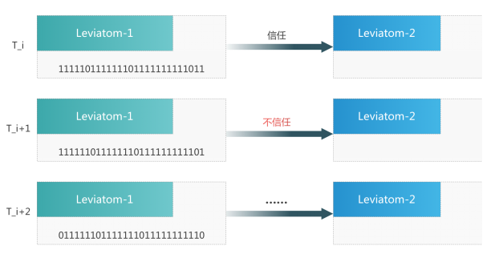 
</div>
<div align=center>图 1 Leviatom-1 和 Leviatom-2 之间的关系随时间变化的图示</div>

在时间t_i两者为信任，则更新信任向量到t_i+1的形式，而在t_i+1为不信任事则更新到t_i+2时间的样子。

### 2.2.2.	用Gossip协议族构建全网信任图模型

我们在本节介绍HCGraph。在图计算中，假设我们使用一个点来表示一个共识节点（Leviatom），用一条有向边表示一个Leviatom向另一个Leviatom发生了证实的关系，那么所有Leviatom的证实关系的组合便形成成了一个Leviatom网络，一个网络节点在某个时间会向其周边的领接节点发起证实的操作，这样它就能够获得一个本地的信任向量，在图2中N_a0便向周边标注为蓝色的3个节点均发起了直接证实的操作，并且保存了一个本地的证实向量。

<div align=center>
 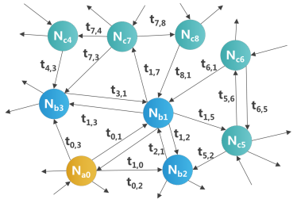 
</div>
<div align=center>图 2 SGTM 算法网络展示</div>

对于全局的网络来说，因为每个Leviatom都会存储与其发生交互的所有邻接节点的信任向量，通过归并这些本地向量便可以获得整个网络的信任关系。比如说在图2中，标注为蓝色的节点是N_a0的一阶领接节点，通过收集这些节点的本地信任向量，并和自身拥有的本地信任向量进行合并，这样就能够获得一个粗略的网络信任矩阵，这一步我们称之为Gossip协议。标注为绿色的节点是N_a0的二阶邻接节点，N_a0会收集这些节点的本地信任向量，并和自身拥有的通过gossip协议创建的信任矩阵进行合并，能够获得一个更加完整的网络信任矩阵，这一步我们称之为Gossip about Gossip协议。考虑到真实网络中小世界网络的特性，通过这种方法往往可以获取到一个比较完整的全局网络互信关系。

HCGraph利用类似于HashGraph的Gossip以及Gossip about Gossip协议(HCGraph的相关Gossip协议发表于2011年[3])，实现高效的信任关系传递。基于此HCGraph进一步实现了Gossip about Reduced Gossip（即减少二阶领结节点传递的信息量），Targeted Gossip（仅部分二阶领接节点传递信息），以优化信任关系传递协议。

### 2.2.3.	基于机器学习的可扩展HCGraph算法

HCGraph的gossip算法中存在着网络热点负载过重（在社交网络中被称为Lady Gaga问题）的问题，在未来真实系统里百万节点级别的分布式环境中会成为横向扩展（scale out）的瓶颈。在此设计一个基于机器学习的网络链接预测的算法，来保证Leviatom之间只计算一阶邻接节点的信息便可以推导全网的互信信息。并设计基于分布式的系统架构来实现此算法。假设我们需要预测Neuron u到Neuron v之间的证实关系，而u到v并没有直接发起过证实。我们可以收集两个类型的图计算信息。

第一个类型仅仅取决于Leviatom u 和 v自身与整个网络世界之间的关系，在这里我们仅考虑 u证实了多少Leviatom可信标记为D^+_out(u)，证实了多少Leviatom不可信标记为D^-_out(u)，v被多少领接Leviatom证实为可信标记为D^+_in(v)，和证实为不可信标记为D^-_in(v)，使用C(u,v)表示u和v的共同领接节点的数量，还有D^+_out(u)+D^-_out(u)和D^+_in(v)+ D^-_in(v)一共有7个维度的信息被收集。

第二个类型的信息取决于Leviatom u和v之间的交互，在网络科学中这个性质被称作Blance and Status，其中心思想就是敌人的敌人是我的朋友而敌人的朋友是我的敌人。假设有个Leviatom w它跟v和v之间有证实关系，那么考虑到证实关系的方向和信任关系，一共有（2*2）*（2*2）=16种关系。我们使用一个16维数组来表示在u和v之间每种关系的数量。

 <div align=center>
 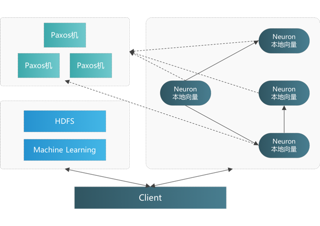 
</div>
<div align=center>图 3 可扩展的机器学习 HCGraph 架构设计</div>

这样看来，第一个类型的信息包含7个维度的计数，而第二个类型的信息则包含了16个维度的计数。结合两个类型的信息，或者仅使用其中一个类型的信息（取决于需要的精确度和付出的计算力）采用机器学习的算法（如Logistic regression, CRF, HMM或者神经网络）对部分数据进行训练，而对另一部分数据进行交互测试。这样便可以达到1）不进行全网互证，2）不收集二阶证实信息，避免网络热点的可横向扩展的互信网络。

因为之前提到的算法是一个在分布式的环境中执行的，那么Leviatom之间的证实关系是实时的存储在Leviatom本地的数据结构中的。实现此算法则涉及到两个问题：1）获取到所有Leviatom周期性的证实信息来训练机器学习模型；2）当需要预测u和v之间的信任关系时，如何抓取到u和v的实时证实信息来进行预测。第一个问题是一个批处理的计算问题，而第二个问题则是在分布式系统中的实时计算问题。针对这两个需求，和Leviatom本地化存储，证实的需求，我们能够抽象出三个模块：

第一个模块（实时异构共识图）是由Leviatom本身和 Leviatom之间的通信所组成，主要的功能便是建立起Leviatom之间的证实关系，并将这些关系存储在本地的可持久化的数据结构中。

第二个模块（批处理机器学习）是由一个Hadoop生态搭建起来的ETL系统加上构建在其上的机器学习组件组成，其采用pull（拉）模型来从各个组件中周期性的同步出Leviatom的证实信息，并且以分片的方式来训练出机器学习的模型，来供后续预测的需要。

第三个模块（弹性拉伸），是一个基于Paxos的状态注册模块，当新的Leviatom加入或者旧的 Leviatom退出的时候，会在Paxos机上注册自己的服务，这样当客户端需要进行服务的时候便能够从Paxos机中寻找到正确的路由信息来进行实时的信息获取和预测。Paxos机是整个Leviatom生态的核心基础，其需要保证高可用，高性能和高一致性。

## 2.3.	Leviatom多层异构算力体系
Leviatom算力网络中的共识节点担负着三类职责，形成逻辑上的三层算力体系：

1.	利用不同的TEE协议收集逻辑相邻节点的可信状态信息；
2.	利用Gossip协议传递与整合逻辑相邻节点所搜集的可信状态信息；
3.	利用本地TEE环境执行合约代码。

第一层算力节点利用TEE技术定期检查其周围节点的正确性。并记录其对齐检查的历史信息。TEE目前包括Intel SGX、Intel TXT、TPM、ARM Trustzone。第二层算力节点利用Gossip协议（以及Gossip about Gossip）收集并传播周围第一层算力节点所收集到的其它节点的正确性信息。基于Gossip所汇总的信息，Leviatom网络将最终归纳出全网络任一节点的“同谋违约”代价模型。即任何一个节点，想要执行非可信代码而不被发现，它需要让多大规模的其它节点与它共通执行非可信代码，或提供错误的信任背书（即同谋）。第二层算力节点所确定的“同谋违约”代价很大的少数几个节点将成为第三层节点，并获得执行任意程序的权力。该层算力节点将最终对执行程序的结果产生共识，并争夺最终的记账权。为适应不同平台的算力特性，Leviatom允许任一节点支持实现三类职责的任意组合。这既增加了共识网络结构的灵活性，又依照算力能力有效分配了共识运算量，实现了高效节能。

# 3.Prometh（普罗米修斯）：去中心化的可溯源软件生态
 本章介绍 **Prometh** 可溯源软件开发框架的基本原理。**Prometh** 的核心模型源自 **TRIAS** 团队在可信软件构建与运维方法的研究，可参考附录文献 [4, 5, 6]。**Prometh** 的详细设计将在 **TRIAS** 技术白皮书中阐述。
## 3.1.软件全生命周期的安全风险
以软件开发的瀑布模型为例，软件生命周期大致分为以下几个阶段：

**设计** 该阶段包括需求分析、功能定义、可行性分析以及软件层面设计等，软件层面设计又可细分为技术选型、框架设计、功能模块界定、数据库结构设计、服务可用性设计等等。设计阶段是项目基础，需要多方配合，尤其对于大型软件项目，需要产品、架构师、开发及运维协同合作，一起设计编写项目文档。随着需求变更或规模增长，需要随时调整软件的设计。因此该阶段可能出现的问题是各角色协同配合以及迭代更新，哪怕是一个很小的细节调整都会影响到生命周期之后的流程，需要很强的可追溯能力。另外，复杂软件会涉及到多个模块，每个模块应有不同的团队负责设计，这就需要明确的权限。

**开发** 该阶段用来编码实现之前的软件设计，无论是 **GIT** 还是 **SVN** 解决了版本管理和协同开发的大部分问题，但针对一些更加具体和严格的条件限制，比如代码质量、编写规范、开发环境等，有的需要引入第三方工具，有的则没有很好的解决方案。比如代码中有一个内存泄漏的BUG，若在该阶段没有被发现，应用上线后轻则拖慢运行速度导致无法提供服务，重则被恶意用户利用来发动攻击。

**编译** 对于 **C++** 、**Golang** 这种静态语言需要进行编译，动态语言出于安全性也可以编译为二进制或字节码格式。该阶段需要保证编译环境及源代码的安全可控，前者涉及到编译工具、依赖的库、编译选项等，后者涉及代码检测。而编译环境往往容易被忽视，比如依赖的库版本太低有漏洞就会导致最终的程序埋下隐患。另外，代码传输到编译环境若涉及到外网，还要考虑是否泄露或被篡改，因此安全传输及完整性校验也是需要关注的点。

**分发/部署** 该阶段将可运行的程序下发到部署前的中心节点或待部署节点，部署后便可启动运行程序。需要验证的条件：部署节点地址及环境可控、可执行程序安全可靠、运行的配置和参数符合预期。此步骤是程序转换为进程运行的最后一步，涉及到分发程序的传输安全性及可靠性验证，当然，如何保证程序在一个完全可信的环境下启动也是重点。还需考虑的就是部署到测试环境进行测试，如何保障测试环境、测试程序及测试结果这条链的可靠、可控，还有就是测试的全面性和准确性如何控制。

**监控** 程序运行后变为进程，进入维护阶段，需要采集和监控程序的运行环境及程序数据，需要保证基础运维数据（包括但不限于 **cpu**、**mem** 、**io** 等）、业务监控数据、运行环境数据等准确高效的采集，当然若需要采集程序也要保证其可靠运行。监控是程序的“听诊器”，维护阶段的重点是持续稳定的产出程序和程序运行环境的监控指标。此外，实时性和防泄露也是要保证的，涉及到故障的及时发现处理和业务数据安全。
分析 该阶段对采集到的数据进行高效分析处理，需要保证进行分析功能的程序稳定可靠、分析的数据安全可信、异常处理规则合规，可以第一时间发现程序或程序环境问题并做出保障服务稳定性与合规运行的进一步操作。监控的特点是具有海量数据，保证数据可信及高效处理是分析阶段的关键。

**响应** 响应可以理解为属于测试和服务范畴，测试阶段需要根据设计阶段的目标，对程序进行功能和压力测试，而到了服务阶段则需要结合监控和分析阶段进行判断。我们可以定义预期的响应时间以及数据格式，不同阶段都可以依据返回状态进行判断是否符合预期。还有一点是防范恶意攻击，比如SQL注入，程序如何响应这种请求是需要计划和考虑的。

## 3.2.用可信溯源建立对软件的安全感
我们这里以有机食品为例，来阐释如何用可信溯源构建消费者对产品的信任感。例如开办餐厅，餐厅管理者并不能直接简单快捷的确定采购食品的有机性、保鲜情况。客户一般的确定方式主要是靠品牌，但是问题来了，现实中就算是茅台酒的总代，它出货的时候都是正品，但是在运输的途中还是可能被掉包换掉。所以客户在买到任何有机食品的时候，实际上没有办法通过客观公正的技术手段确认这个产品是否满足要求。
但是如果通过技术达到无法篡改的属性，将整个有机蔬菜的生产到运输缴费的环节信息都放在这个无法篡改的技术上面，那么任何一个客户都会对整个食品的全生命周期有了透明的判断，客户就能对购买食品的品质有提前的预估。同时，对于整个生产环节的参与方都提供了不可抵赖的追责依据，让每个生产环节想要犯错或者作假的成本都很高。这样客户在购买的时候就会非常有安全感，消费的效率和生产的成本流程控制都会提高很多。
**Prometh** 框架即是利用溯源的方式来构建用户对软件的信任感。让每个用户在使用软件前就能提前进行预估，对软件的所有生命周期，包括产生、开发、测试都非常的了解，就能实现对软件执行过程中犯错或加入后门等恶意行为进行高强度的追责和防御。具体技术路径基于当前业界已经成熟的开发 （**Dev**）运维（**Ops**）自动化上链，配合安全（**Sec**）与 **AI** 来实现软件完整构建、分发、运行流程在区块链上的可信溯源，与自动化安全验证。

## 3.3.Prometh可溯源软件开发框架
**Prometh** 是一个去中心化的可信软件溯源网络框架。其中，去中心化和可信性是基于 **Leviatom** 网络来实现的。区别于其它任何软件框架或开源平台，**Prometh** 致力建设一个全功能、高可信度、易接入的软件全生命周期生态系统。**Prometh** 特性如下：
覆盖全生命周期。**Prometh** 结合 **Leviatom** 覆盖软件全生命周期建设，从设计、开发、测试，直到运行、监控、销毁。 **Leviatom** 负责程序的可信执行，**Prometh**负责程序的可信状态管理，二者结合做到了对软件的无死角管理。
通用软件的可信溯源。**Prometh** 实现了软件全生命周期的不可篡改的完整记录，以及循环迭代实施的安全分析，构建了用户对软件安全性的信心。同时，**TRIAS** 通过整合具备软件安全性分析激励机制的经济模型，构建通用软件的安全可信的软件供应链体系，实现了软件可溯源、漏洞的高效发现与修复的良性生态系统。
对于复杂的智能合约代码，用形式化方法验证其安全性将变得极为复杂。用形式化验证分析所有原生应用程序源代码的安全性，更是不切实际。**Prometh** 提出基于软件生命周期可信溯源的验证框架，在安全性和复杂度之间寻找平衡点。在未来的版本中，**Prometh** 将用形式化验证方法来验证一套用以构建软件的最小软件工具集，再用该工具集构造更大的工具集，依次迭代，为可溯源软件工具链构

<div align=center>
 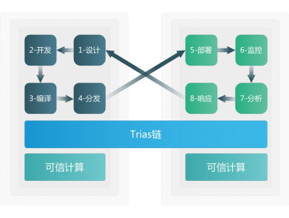 
</div>
<div align=center>图 4 TRIAS的软件生命周期示意图</div>

于形式化验证的软件可信根。


生态体系建设。**Prometh** 的使用者可以是个人开发者、测试人员、用户、商业公司甚至是黑客。任何开发者可以发布自己的应用到 **Prometh** 上，这个过程中系统会自动分析应用的安全性并给出初期评分，这是基于最小的形式化验证和溯源模型实现。而后，人工校验阶段即测试或者黑客可以基于自己的专业发现应用问题并提交，这些问题经过验证会附在应用的标签上，开发者可以去修复这些问题。这期间评分是动态变更的，用户可以基于评分和描述去评估应用是否可用。这其中还引入了激励机制，这在后面的章节会提到。

框架接入简单。应用的开发者只需提供一些基础信息就可以很容易的将应用发布到Prometh上，基于高阶范式接口，不会限制应用的语言和框架。基于形式化验证+软件溯源+生态人工校验机制，实现几万行源码的大应用接入也十分安全、高效。
开发应用简单且可订阅的安全性。**Prometh** 不仅支持任何语言开发的应用，而且还支持开发者引用已经在 **Prometh** 上部署的应用，这样可以大大提高开发效率和安全性。因为不止代码和功能可以复用，即使被发现安全问题，任何使用基础应用的上层应用都会被描述为有同样的问题，并且支持开发者订阅从而得到通知，实现版本的更新或问题的修复。
可以看到可溯源软件架构在运行模式上分为四层模型，从下往上依次是：
 **DevSecOps** 可信区块链层。软件生命周期内产生的数据信息和依赖的工具都存储在该链上，用分布式存储和高效共识为软件溯源提供底层支撑。软件生命周期内产生的数据信息包括用户信息、分析工具产生的数据信息、产生的结果数据等，依赖的工具主要是两类，一类是功能性工具，比如编译工具，另一类是安全分析工具，比如静态分析工具。这两类工具都将经过形式化验证，保证工具集的安全性。
功能和安全分析层。指在DevSecOps可信区块链层存储的，通过了形式化验证的最小软件工具集。这些工具集的功能就是执行软件流程层的行为以及验证分析软件生命周期内各阶段的安全性。对于应用开发者来说，这些工具集是透明的，当检测到安全风险时，将中止软件生命周期并通知应用开发者原因。这些工具集内的工具分别独立运行且经过形式化验证，而后通过链上的流控形成一个整体，产生的数据

<div align=center>
 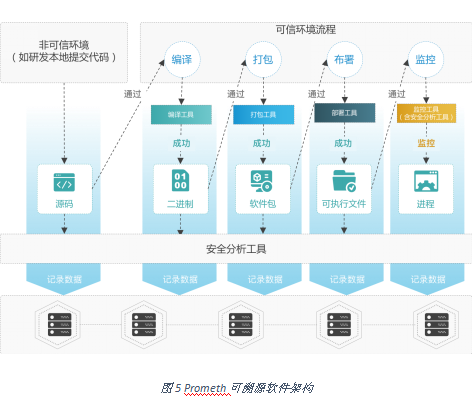 
</div>
<div align=center>图 5 Prometh可溯源软件架构</div>

会存储到区块链层，用来防止篡改保证可信度。
软件状态层。主要对软件生命周期内各状态追踪、记录及管理，这些软件状态是独立的、静态的，其中每个状态产生的信息数据都会记录到 **DevSecOps** 可信区块链层。因此任何一个软件状态都可以被溯源。
软件流程层。该层管理软件生命周期行为，相对于软件状态层的静态，流程层是动态的，只有触发流程行为才能改变软件静态状态。可以理解为行为接受一个输入即软件的上一个状态，产生一个输出即软件的下一个状态，当产生错误时，下一个状态是中止。另外，行为和流程是可以被配置定义的链上数据。可以看到，只有提交代码在非可信环境下执行，其它流程都在链上的可信环境内执行，确保执行流程的环境可信。
以图5为例的流程分析如下。开发者将软件源码通过接口上链从而启动整个DevSecOps流程（图上步骤1），开发者的提交环境是不可信的，这不会最终影响应用的可信度，因为在其它流程内保证环境、数据和工具可信。流程启动后会通过链上可信的静态分析工具对提交的代码进行分析（步骤2），而后存储代码、用户信息及分析数据到链上（步骤3），通过后根据定义的流程触发编译行为（步骤4），依据可信的编译工具和环境对上一步的源码编译（步骤5）并记录编译数据（步骤6），成功后生成二进制（步骤7），而后对二进制进行安全分析（步骤8）及记录结果（步骤9）。接下去触发打包行为（步骤10），基于可信打包工具和环境对编译结果打包（步骤11），记录打包数据到链上（步骤12），成功后生成软件包（步骤13），而后继续对软件包进行安全分析（步骤14）并记录结果（步骤15）。软件包安全分析通过后触发部署行为（步骤16），使用可信部署工具执行（步骤17）及记录部署数据（步骤18），成功后生成可执行文件（步骤19），然后对可执行文件进行安全分析（步骤20）及记录数据（步骤21），成功后，比如部署到了N台可信节点内运行，会触发监控行为（步骤22），监控会依据可信监控工具对进程监控（步骤24）并记录监控数据到链上（步骤25）。


#4.MagCarta（大宪章）：全平台编程的智能合约模型 
本章将简要介绍 **MagCarta** 合约的核心设计理念。**MagCarta** 的完整语法设计、虚拟机实现、以及可编程共识的合约范例均将在 **TRIAS** 技术白皮书中做详尽的阐释。
## 4.1.MagCarta数据结构
**MagCarta** 是 **TRIAS** 平台的智能合约，它实现了 **Prometh** 应用程序在 **Leviatom** 网络上的灵活调度，**MagCarta** 通过为 **Leviatom** 节点与 **Prometh** 程序开发者支付酬劳费用以及保险费用，实现对算力、程序、数据贡献者的激励与安全保障。**MagCarta** 采用类似 **JSON** 的语法描述数据结构：
```
Key: Value}
```
在下文的描述中，我们用$符号说明其后的关键字为变量，其值可由用户自定义，而不带$符号的关键字为系统保留关键字。


### 4.1.1.算力描述
算力描述结构说明了 **MagCarta** 合约对算力的特性定义，它详细解释了满足怎样条件的算力节点才能执行目标程序，其基本结构为：
```
 {COMPUTE : $COMPUTE_NAME,
$PROPERTY_KEY: $PROPERTY_VALUE,
	…
}
```

其中第一行定义了一个名为 $**COMPUTE_NAME** 的算力说明结构（**COMPUTE**），从第二行起，定义了该算力节点个各类属性（$**PROPERTY_KEY**）的目标值（$**PROPERTY_VALUE**）。
$**PROPERTY_KEY**可由系统预定义，也可以是 **Leviatom**节点所达成共识的属性标签。这里简述几类常用的预定义属性。
**TRUST_VALUE** 代表节点可信值，其为 **Leviatom** 节点收集与传递的基本属性。**TRUST_VALUE**代表了目标节点的“同谋违约”代价，即目标节点执行非指定代码而不被周围节点“举报”的代价，要实现同谋违约，攻击者需同时获得为目标节点贡献信任背书的所有其它节点，以及所有为这些节点贡献信任背书的所有其它节点，以此推类，直到新的一层信任背书关系全由已达成同谋关系的节点产生。**TRUST_VALUE**的取值范围通常由两个指标定义：值区间（ **VALUE_RANGE**）与时间区间(**TIME_RANGE**)，意指在给定时间区间内，始终满足TRUST_VALUE始终处于值区间内的所有节点。
SOFTWARE_STACK 指定目标节点上的系统软件栈满足预定义的条件。该属性用于指定目标节点必须“预装了某版本的某软件”，或该类节点“不能预装由指定版本的软件“。SOFTWARE_STACK属性有助于让程序执行者更准确地定位其程序的执行环境。如，用户可指定其应用程序仅在安装有特定版本的防火墙以及入侵检测系统（**IDS**）的节点上执行。SOFTWARE_STACK为目标节点在TRUST_VALUE之上增加了更多了对节点安全、功能属性的描述。**SOFTWARE_STACK** 的值可由下一节所定义的程序描述符指定。
**DATA_STORE** 指定目标节点上拥有的数据的特征。该属性可用于指定目标节点存有满足需求的待处理数据集。将数据集也作为节点的定义属性，将有助于实现“基于数据特征的路由”。对特殊数据由处理需求的用户，可将程序通过 **MagCarta**合约在 **Leviatom**网络中路由到存有目标数据的节点，并在该节点本地执行对数据的分析处理。这里，MagCarta实现了“无数据交换”的多方协同处理。
POS 指定目标节点的拥有者所对应的账户拥有特定比例的 **Token**。该属性将程序路由到满足特定POS的节点上执行，这相当于给这些节点记账的权力。该属性允许MagCarta实现对兼容现有 **POS** 或 **DPOS** 共识算法的兼容。
**NETWORK_ADDR** 指定目标节点拥有特定的网络地址。网络地址可用 **TCP/IP**协议的地址规范描述。该属性与传统互联网实现直接的兼容，可让用户将程序或者数据传输给指定 **IP：PORT** 对上的应用程序。
4.1.2.程序描述
程序描述结构说明了 **MagCarta** 合约对 **Prometh** 程序的特性定义，它详细解释了如何选取满足用户需求的目标程序，其基本结构为：
```
{PROGRAM: $PROGRAM_NAME,
        $PROPERTY_KEY: $PROPERTY_VALUE,
	…
}
```

其中第一行定义了一个名为$**PROGRAM_NAME**的程序说明结构（**PROGRAM**），从第二行起，定义了该程序的各类属性（$**PROPERTY_KEY**）的目标值（$**PROPERTY_VALUE**）。
$ **PROPERTY_KEY** 可由系统预定义，也可以是 **Prometh**验证着所达成共识的属性标签。这里简述几类常用的预定义属性。
**ID** 该属性定义了程序的唯一身份标识符。
**VERIFIED_DESCRIPTION** 该属性定义了程序的特定功能属性由指定的验证程序完成了验证。该属性的值可为一套 **<key,value>** 映射，用于说明程序的某个属性（由 **key**定义），被某个程序（由 **value**）实施过自动化的验证。这里的验证程序可为 **Prometh**上的另一套程序。该程序的属性也服从 **VERIFIED_DESCRIPTION** 的定义规则，即其功能、安全属性由另外一套程序所验证。因此，**VERIFIED_DESCRIPTION**属性定义出了程序的验证关系树，该树将最终追述到一套经由形式化验证的可信软件基础工具集。
**SIGNED_BY** 该属性与传统的基于软件身份证书的软件完整性验证方式相兼容。该属性指定软件由特定的可信第三方签名，由其背书安全性。
### 4.1.3.数据描述
数据描述结构说明了 **MagCarta** 合约对一段待处理数据的特性定义，其基本结构为：

```
{DATA: $DATA_NAME,
        $PROPERTY_KEY: $PROPERTY_VALUE,
	…
}
```

其中第一行定义了一个名为$**DATA_NAME**的数据说明结构（**DATA**），从第二行起，定义了该端数据的各类属性（$**PROPERTY_KEY**）的目标值（$**PROPERTY_VALUE**）。
$**PROPERTY_KEY** 可由系统预定义，也可以是 **MagCarta**用户自定义的属性标签。这里简述几类常用的预定义属性。
**ID** 该属性定义了该段数据的唯一身份标识符。
**VERIFIED_DESCRIPTION** 该属性定义了该段数据的特定属性，以及为其提供属性验证背书的验证程序。该属性的值可为一套 **<key,value>** 映射，用于说明了数据的某个属性（由 **key**定义），被某个程序（由 **value**）实施过自动化的验证。这里的验证程序可为 **Prometh**上的另一套程序。该树也将最终追述到一套经由形式化验证的可信软件基础工具集。
###4.1.4.合约描述
合约描述结构声明了一份 **MagCarta**合约，其基本结构为：
```
>{CONTRACT: $CONTRACT_NAME,
COMPUTE_DECLARATION: {$COMPUTE_TYPE_1:$COMPUTE_NAME_1, …},
PROGRAM_DECLARATION: {$PROGRAM_TYPE_1:$PROGRAM_NAME_1, …},
DATA_DECLARATION: {$DATA_TYPE_1:$DATA_NAME_1, …},
TX_DECLARATION: {$TX_TYPE_1: $TX_NAME_1, $TX_TYPE_2: $TX_NAME_2, … },
CODE_BLOCK: { $CODE_BLOCK_PROPERTY_NAME_1: $CODE_BLOCK_PROPERTY_1, …},
	…
}
```

其中，首行定义了合约的名称，第2到4行分别是合约的变量声明，其中包括了对算力（**COMPUTE**），程序（**PROGRAM**），数据（**DATA**）的声明。这些变量将在程序逻辑中（**CODE_BLOCK**）被引用。
第5行定义了合约的输入，即交易（**TRANSACTION**）的格式。一个交易定义了包括传入合约的变量，其可包括算力、程序、与数据。定义如下：

```
{TX: $TX_NAME,
COMPUTE: <$COMPUTE_NAME_1, … >,
PROGRAM: <$PROGRAM_NAME_1, …>,
DATA: < $DATA_NAME_1, …>,
…,
}
```

第6行定义了合约代码的属性，通常包括代码的存储地址、长度，代码的哈希值，签名等信息。
## 4.2.MagCarta合约语法
**MagCarta** 将采用类似 **EOS** 的智能合约语法，以实现图灵完备，并最大程度兼容现有 **dapp** 合约。在此基础上，**MagCarta** 新增了 **consensus**语句，以实现对 **Prometh**应用程序在 **Leviatom** 算力网络上的调度：

```
consensus(COMPUTE_SET, PROGRAM_SET, DATA_SET, STRATEGY_SET)
```
该语句实现了指定 **PRORAM_SET**内的程序，在 **COMPUTE_SET** 内的算力节点上，以 **DATA_SET** 内的数据为输入的 **MagCarta Consensus** 。**STRATEGY_SET**里包括了用于指定付款策略的 **PRICE_STRATEGY**，以及制定了 **COMPUTE**，**PROGRAME** ，与 **DATA** 之间的映射关系的 **SCHEDULE_STRATEGY**。根据不同的策略组合，**MagCarta**可支持丰富高阶的编程范式。
在 **STRATEGY_SET**中，最重要的 **STRATEGY** 是 **CONSENSUS_STRATEGY**，它指定了不同 **PROGRAM **如何达成共识的。若共识成立，**consensus**返回 **PROGRAM** 程序所达成的共识的结果，通常是程序任意一份执行副本的正确返回值。若共识失败，**consensus** 返回错误指令。
### 4.2.1.同构共识范式
同构共识是指所有共识节点依照同样的标准来判定目标交易正确性，当前绝大多数共识算法都采用同构共识策略。在 **MagCarta Call**中，将同样的应用程序分发到不同的算力节点上，通过比对返回结果所达成的共识即为同构共识，其最简单的形式是：

```
consensus(COMPUTE_SET, PROGRAM_NAME_1, DATA_NAME_1, STRATEGY_SET)
```

这里 **MagCarta**将 **PROGRAM_NAME_1** 指定的一个应用程序调度到由 **COMPUTE_SET** 指定的算力节点上执行，并且不考虑 **COMPUTE** 节点的差异。在这里 **COMPUTE_SET** 可以是满足任意要求的任意组合的计算节点。
在同构共识的基础上，**MagCarta Call** 还可支持对同构性要求更高共识需求：强同构共识。在这里，不但要求共识程序一致，还要求所有共识程序所处的算力环境也满足一致的标准。

```
consensus(COMPUTE_NAME_1, PROGRAM_NAME_1, DATA_NAME_1, STRATEGY_SET)
```

### 4.2.2.异构共识范式
异构共识是指参与共识的验证节点各自有不同的评判标准。在现实生活中，异构共识的应用场景远超过同构共识：面试委员会成员根据不同的评判角度为能否录用候选人投票；董事会成员根据所代表的不同股东的利益为公司重大决策投票；美国选民根据所在的不同团队的不同价值观选举美国总统。在信息系统中，软件的安全性、业务的合规性也往往由多个不同的评判程序实现，如我们往往用不同厂商不同版本的杀毒软件扫描关键文件，从而达成文件安全性的共识。
**MagCarta Consensus**通过在 **PROGRAM_SET**中指定不同的应用程序，并设定相应的 **CONSENSUS_STRATEGY** 实现异构共识：

```
consensus(COMPUTE_SET, PROGRAM_SET, DATA_NAME_1, STRATEGY_SET)
```

在这里，**PROGRAM_SET** 可指定多个参与共识的应用程序，**CONSENSUS_STRAEGY** 则可定义不同程序的冗余执行程度（如某份程序需执行多少份），不同程序的投票权值，以及最终达成共识的最小加权权值。

### 4.2.3.可编程共识范式
同构共识或异构共识均为对一个或一组标的物（**DATA_SET**）具备某种属性的共识。当共识达成，所得到的共识结论，可作为待处理的数据，成为其它共识流程的输入。因此基于输出/输入数据的关联性，**MagCarta**可构造迭代共识结构。同时，由于 **MagCarta** 将支持图灵完备的语法，基于 **MagCarta Consensus** 可实现更复杂共识语义，用可编程共识实现高可信的商业应用逻辑。

# 5.	TRIAS生万物：重塑人机信任

## 5.1.	公链与智能合约安全
### 5.1.1.	公链、交易所加固与共识算法升级提速
**痛点描述** 安全性和性能是现有区块链技术面临的两个主要问题，也成为了制约区块链技术的进一步推广和落地的主要因素。区块链的安全性包括软件漏洞、网络攻击、Token隐私泄露等方面。如何提升区块链的安全性，已经成为业界关注、讨论和研究的重点。区块链的性能包括TPS、弹性扩展性不足等方面。如比特币现有的TPS仅有7，以太坊现有的TPS仅有20，这样的共识速度几乎无法满足实际生产中各类应用的性能需求，相对应的，VISA在实际生产中的TPS可达到上万级别。

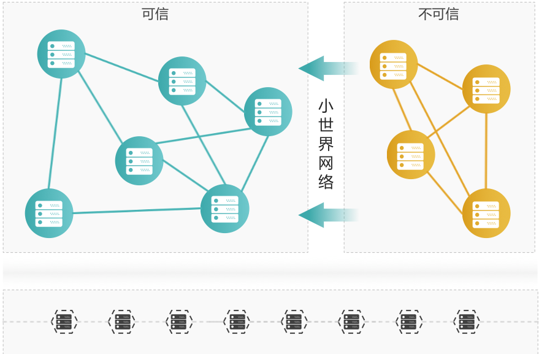

**解决方案**  与传统的公链相比，Leviatom能够提升链的安全性和共识速度。基于HCGraph技术，TRIAS中的Leviatom能够在节点间构建小世界网络，该网络能实现接近90%的“同谋违约”代价。即任何一个节点想要“撒谎”，则不得不迫使全网90%的其它节点为它“圆谎”。此特性可并将传统区块链的抗51%攻击提升至90%的恶意算力攻击。Leviatom通过快速定位全网中“最难撒谎的点”，并为少数这些点分发智能合约程序，从而最终提升共识速度。同样的，Leviatom也能够快速定位不可信的节点，并将其冷却或移出，保证自身的安全性。在同等节点规模和计算能力的情况下，Leviatom的共识速度将达到以太坊当前共识速度的5000-10000倍。

**应用场景**  Leviatom可作为现有公链的基础运行环境，即将诸如ETH、EOS等可作为DApp运行于其上，这样可以通过底层的Leviatom保证节点的安全性。如果某些节点被恶意攻击时，Leviatom也能够快速的识别到这些不可信节点，并将其与安全的运行环境间隔离开，进而降低恶意攻击对公链造成的影响，从而实现对运行其上的公链的安全加固。此外，Dapp可选择“少数”指定可信值的节点来运行，并达成共识，这将一改传统区块链需要全网所有节点参与共识的低效现状，提升共识速度。

### 5.1.2.	复杂智能合约形式化与可溯源
**痛点描述** 智能合约的安全漏洞导致的攻击事件层出不穷，每一次安全事件往往会导致重大的损失，如The DAO事件涉及到上百万的以太币。传统公链虽然在共识算法层面具备理论上较高的抗攻击能力，但随着其上支持的智能合约程序逻辑越来越复杂，智能合约本身安全性已经成为制约整个公链生态系统能否良性发展的重要因素。

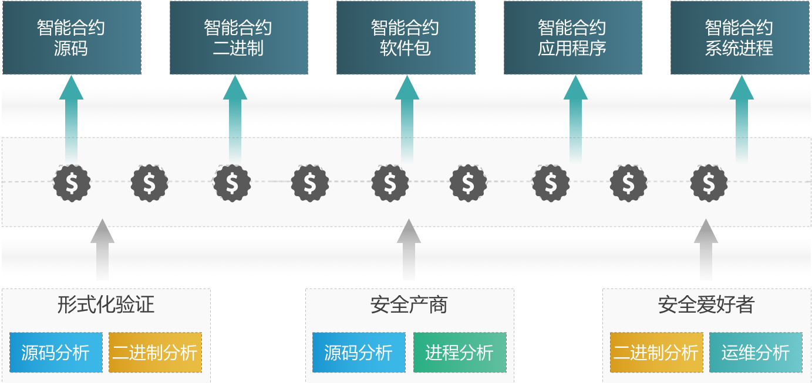

**解决方案** TRIAS中的Prometh提供了形式化验证+软件溯源的验证框架，在安全性和复杂度之间寻找平衡点。Prometh首先用形式化验证方法验证一套用以构建区块链上软件的最小软件工具集，再用该工具集构建更大的工具集，依次迭代，并用完整的工具集完成通用软件的可信构建与安全评估，最终实现了通用软件基于可信源的可溯源构建。同时，合约的整个生命周期的数据均会上链。Prometh还将引入奖励机制，激励安全社区对合约做安全性分析，使得多方受益，形成良性的智能合约安全生态。

**应用场景** 运行于传统公链上的复杂智能合约，可通过Prometh对其进行形式化验证，完成对复杂智能合约的可信构建和安全评估，尽可能的在发布智能合约前就发现其内在的安全隐患，将复杂智能合约上线后的安全风险降到最低。如果复杂智能合约在运行的过程中出现了安全问题，那么可通过Prometh对其进行溯源，定位造成该安全问题的原始信息。此外，这些复杂的智能合约还能够利用TRIAS安全社区，挖掘自身安全问题，并快速迭代。

### 5.1.3.	数据可信上链

**痛点描述** 区块链因数据在共识上链后的可溯源、不可篡改等属性，在众多领域都被赋予了应用和落地的可能性。然而，生产环境的自动化数据采集程序的安全可信性难以验证，无法保证数据在采集上链时是否被恶意篡改；此外，如果采集节点被恶意攻击，那么同样无法保证数据的可信性。一旦数据可信性无法保证，那么数据上链的意义也会随之大打折。所以，能否保证数据可信上链，是制约区块链技术在实际生产中应用和落地的一个重要因素。

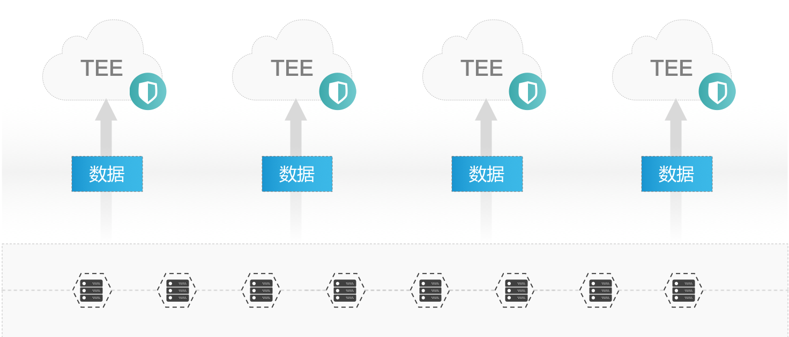

**解决方案** Leviatom利用可信执行环境，把用户关键程序或者采集数据上链的程序，在执行的时候都放到TEE中，由可信计算技术来保证程序执行环境全部符合白名单行为，不会受异常进程/线程/恶意文件等的影响来保证运行环境的安全。一旦有任何异常行为造成区块链执行环境有任何和白名单的不一致，这些节点就能立刻进行辨识和排除，并且无法再继续参与正常的业务处理。此外，Prometh提供了形式化验证+软件溯源的验证框架，能够完成对数据采集程序的形式化验证和溯源。

**应用场景** 如果采集节点被纳入Leviatom可信算力平台，那么采集节点的可信状态会被实时计算和监控。同时，采集节点的实时可信状态，也会随着数据一起上链，作为数据可信的依据之一。即使采集节点被黑客恶意攻击并拿到管理员权限，Leviatom仍然能够快速识别并将其从可信算力平台中移除，那么这一采集节点将无法继续把数据上链，该节点甚至无法继续参与其他计算服务，最大化的保证上链数据的可信。

如果采集节点的采集程序想要运行与Leviatom之上，那么就必须在Prometh上进行程序的形式化验证，并记录其程序生命周期的属性，保证采集程序的可信和可溯源。如果采集程序被恶意篡改或者存在后门，那么均可通过Prometh进行溯源。此外，采集程序也会被安全社区持续分析，发现程序脆弱性的社区参与者将会得到对应的经济奖励，保证采集程序的安全性的快速迭代。TRIAS从数据采集节点的运行环境可信和采集程序的可信两个层面，保证数据的可信上链，能够加速区块链技术在众多领域的实际应用和落地。

## 5.2.	个人/企业系统安全可信

当前高危漏洞逐年攀升，根据Gartner调查显示，75%的安全漏洞发生在应用程序层；NIST数据显示，92%已知的安全漏洞存在于应用程序中。如何在整个安全开发生命周期中帮助软件降低安全问题，将应用安全问题前置到研发流程中，最大程度解决高危漏洞，优化整个安全流程，降低安全成本及安全风险成为始终萦绕在软件开发者以及服务商的困扰。

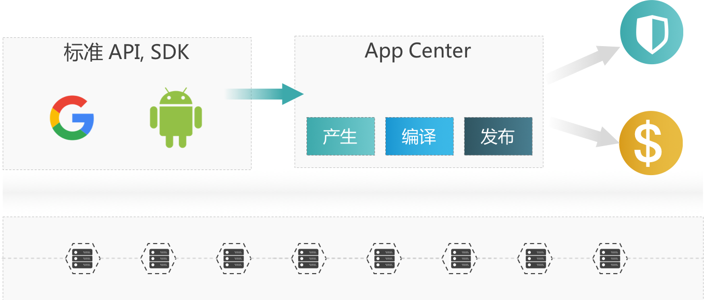

传统开发一般以项目开发结束为目标，缺乏过程的中间控制，过程问题无记录且容易被篡改；对于项目事后出现的问题，很难准确发现并追责。TRIAS利用Prometh开发框架，实现了软件开发/运行（DevOps）生命周期的完整存证与溯源，并结合自动化安全分析工具，迭代地挖掘DevOps过程中出现的安全问题。同时，利用Leviatom，TRIAS保障所有设备的状态可信。

在软件开发尤其是软件外包工作的场景中，TRIAS可辅助实现审计、用户行为分析、授权管理等功能。如工作内容及配置文件需在外包工作区内进行操作，工作区的全部信息均被自动写入Prometh，从而防止开发人员的误操作及恶意操作对系统造成不可挽回的损失。

### 5.2.1.	可溯源的软件仓库及威胁情报生态

**痛点描述** 从DevOps兴起开始，自动化成为了很多企业追求的目标，CI/CD的出现整合了软件生命周期中相当一部分繁琐的、容易出错的步骤。与此同时，虽然有很多明星级产品存在，比如GitHub和Jenkins，但线上服务的安全问题依然层出不穷。究其原因，每个工具只是负责软件生命周期中的一个或几个环节，它们之间相对来说是孤立的，即使简单的整合到一起，也很难完整的监控整个周期。比如软件编译期间引入了一个有漏洞的库，导致软件上线后被攻击，诸如这类问题可能会被监控发现，但造成损失已经不可避免，而且排查问题比较困难。

**解决方案** 无论对于哪种开发模型，软件的生命周期管理都少不了一个可信的安全环境，任何被证明很成功的工具都可以继续使用，比如GitHub和Jenkins。而需要做的是把软件生命周期内的关键数据进行可信的存储，这样就能做到防篡改和可追溯，且不会对上层流程进行过多干预。

TRIAS不仅具有区块链的防篡改和可追溯特性，而且依托经过形式化验证的工具来保证软件生命周期的安全可靠。另外还可以利用智能合约去获得更多安全加成，比如将威胁情报加入代码检测过程用来发现漏洞。用户可以像插件一样随意插拔安全组件，定制自己的发布流。与此同时，在底层的Leviatom会保证全链条的主机可信即执行环境安全，杜绝安全死角。

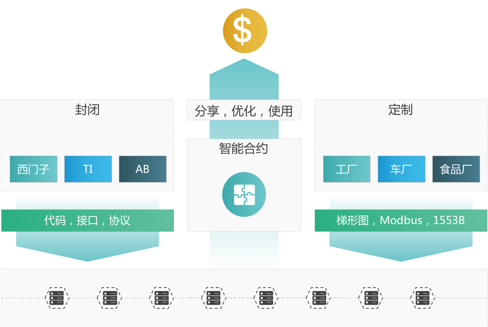

**应用场景** 任何可以定制化、流程化的软件生命周期均可以作为TRIAS软件溯源的应用场景。比如开发者用C开发了一套运行在Ubuntu操作系统上的应用，从开发者编写和提交代码开始，TRIAS即开始了该软件的可溯源生命周期：源码经过Prometh上可信的安全工具分析并记录结果，不符合安全性或语法要求则通知开发者，流程结束，符合则继续使用Prometh上可信工具进行编译及安全分析，以此类推，直到成为系统进程。对这个进程，可以追溯每个生命周期环节，知道每行代码是谁写的，用了什么库，适用于哪个版本等。

5.2.2.	可溯源的可信Linux企业级操作系统，及其可信应用生态
**痛点描述** 在Linux系统中运行了很多程序进程，即使对于一个很有经验的系统管理员来说，也不能很快捷和高效的获取详尽的进程信息来判断是否为恶意加载的程序。即使是一个正常应用，想查询它的版本、依赖甚至漏洞，可能要通过不同命令参数或者借助互联网，复杂不说，可信度也无法保证。系统中的应用若对系统管理员或用户相当于一个个黑盒，可控和安全性便无从谈起，可信的应用知情权是维护系统所需的。另一方面，若系统中某个应用被爆出有一个严重威胁安全的漏洞，而系统管理员或安全人员没有及时获取该信息并进行修复，那么就可能威胁到系统甚至整个局域网的安全运行。

**解决方案** Leviatom使用可信计算保证了运行在主机上的程序是合规的。其次，Prometh上会存储合规进程的关键信息，比如应用版本、Hash、作者、发布及运行时间等，这样就对程序的身份做了一个标识，做到程序可溯源。另外，还可以依据智能合约做安全检测，定期扫描系统上的应用信息与漏洞发布平台发布的版本是否匹配，如发现漏洞则立即报警给管理员，要求其关注并修复该程序。

更进一步，还可以在Prometh上管理应用的依赖关系。比如对一个软件的升级或降级版本，会导致依赖他的软件有兼容性问题，那么智能合约检测到变化会依赖可溯源的软件状态自动调整版本或发送报警给管理员处理。


**应用场景** 一个系统部维护了不同数据中心的几万台服务器，这些服务器分属不同业务部门运行不同业务，因此系统和在其上运行的应用均不相同，这些服务器与运行的应用信息都通过TRIAS来管理。某天，系统部的系统管理员收到了某批次服务器上OpenSSH的0DAY漏洞警报，里面详细描述了漏洞信息、受影响服务器地址、漏洞修复方式等。系统管理员于是立即修复漏洞，解决了这次安全危机。这就是TRIAS可溯源应用和漏洞扫描智能合约联手实现的场景之一。

### 5.2.3.	可溯源的可信Android系统，及其可信应用生态

**痛点描述** 应用的安全问题从Android系统诞生伊始伴随至今，随着Android市场规模扩大，软件应用量增多的同时软件商店也不断增加，大量具有漏洞风险及流氓性质的APP层出不穷，这些APP往往导致应用内信息泄露、远程代码执行、拒绝服务等很多安全问题，严重危害用户信息和使用安全，导致应用无法运行甚至手机系统权限被盗、被控制监控等，比如挖矿木马就是控制用户手机进行加密货币获取并存入攻击者钱包。另外，正规的Android应用平台上也不能避免被恶意应用入侵，比如早前就在Google Paly应用商店上发现了恶意软件Dvmap，它将恶意代码注入到Android系统库并获取系统权限安装更多非法应用。


**解决方案** TRIAS可以实现直接与Android的软件生态应用商店对接的方式，只要Android的软件生态应用商店的服务商把对应的源码编译直接接入到TRIAS的DevOps的自动智能合约入口，就可以把Android的每个应用软件从产生，编译，发布进行全面的溯源。这样如果有人进行定制或者恶意的修改都会被TRIAS监控，溯源，举证。让Android的应用软件生态能从软件生命周期出发进行全面化的抵御，并对在Android应用生态中的优秀贡献者进行激励。

**应用场景** 一个应用A实现了一个发短信的服务，并需要申请Send_SMS权限，但应用A的开发者暴露了该服务且没有进行权限限制。这时用户手机上的其它恶意程序就可以利用应用A暴露的服务发送恶意扣费短信，造成用户财产损失。若应用A要发布在结合了TRIAS的应用商店上，则会被TRIAS上的安全漏洞分析过程检测出权限暴露漏洞，从而终止应用发布并提醒开发者修复漏洞。

### 5.2.4.	可溯源的可信工控操作系统，及其可信应用生态

**痛点描述** 当前的工控OS存在着封闭与定制化两个典型问题，比如西门子的工控PLC和AB公司的工控设备等，操作系统都存在封闭和定制化特点。甚至很多都是纯嵌入式的软件，从功能属性来说都达不到工控OS的程度。
产生现状的原因是多方面的，一方面是企业的产业利益与布局，工控设备厂商都希望有自己的闭环生态。另一方面目前的工控设备大多性能并不像移动设备那么强，所以为了高效完成对应的功能，都是定制化制作和现场总线工控有关的内容，甚至如MODBUS这样的工控协议采取全明文没有加密的方式，安全性很差，长此以往工控的应用生态也发展缓慢。

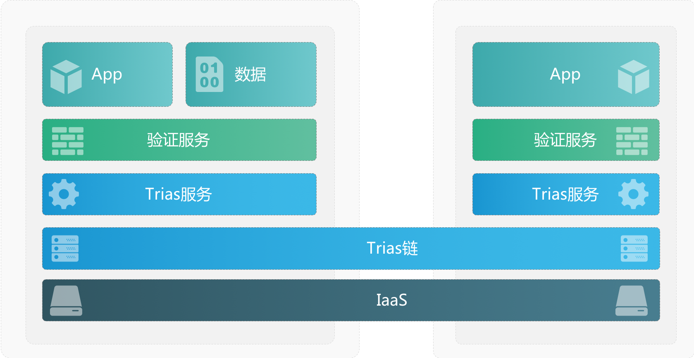

**解决方案** 采用TRIAS，把当前的工控应用软件和工控OS进行全生命周期的溯源和上链共同分析和贡献，给予相应的激励。这样就能打开工控软件领域的全球助力的分享，实现工控软件生态的区块链github，从链和激励的角度让工控软件进行高质量的统一可控的环境，让所有的工控软件快速发展和共赢进步。

**应用场景** 一个工控应用程序的每一个版本在上线前，通过Prometh记录其从设计、开发、编译到部署中的每一环节。如果所使用的工控程序被攻击，可以通过Prometh查询所使用的版本的工控程序原始信息，确定出现问题的原因，并定位责任方。此外，该工控程序可通过TRIAS安全社区，挖掘程序存在的安全漏洞，并快速迭代。挖掘程序漏洞的社区参与者，将受到TRIAS的激励，进而形成良性的循环。

## 5.3.	企业多方协同运算

数据是公司运营决策的基础。尤其对于互联网公司而言，如何对待数据体现了公司对自身业务发展是否有清晰的认知和长远的规划。数据如此重要，是因为巨大的可挖掘潜力，任何个人与团体的属性和行为数据都可以被采集、挖掘、分析并做为服务提供商的核心依据。作为数据提供者的个人或团体，最理想的情况是可以控制自身的哪些数据被可信采集，而哪些信息又是隐私数据不允许采集，而作为数据采集者的公司可以做到的是保障这些数据的安全性和隐私性，回馈给那些提供数据的个人或团体更加优质的服务。

在当今市场中，如果一个公司仅仅是单独挖掘自身数据潜力，对其它数据资源无动于衷，就会逐渐失去行业竞争力。数据流动性的特点以及量变产生质变的特性可以推进行业内或跨行业间数据的互利共享，依托数据构建的立体化产业链能更好的发挥各参与节点的优势，提供更优质的服务或产生更多的创新源动力。与此同时，跨部门或公司的数据安全交互与隐私数据保护是一个重要课题，产业链上的节点需要对方的数据创造更大价值，同时提供自身数据时又担心被第三方窃取或联盟节点非法使用，这使得数据共享的局面并不是很开放。

TRIAS从根本上解决了该问题。每个产业链上的节点不需要传输自身数据，完全可以根据下游节点的需求开发合约对自身数据进行分析处理，然后将结果保存到区块链上供有权限节点使用，每个节点也可以根据自身需求提供开放的合约给联盟内其他节点运行，以期获取需要的分析结果。这些所有的流程与权限管控都运行在TRIAS上，公司的数据保存在本地不必担心泄漏，产生的分析结果保存在区块链上做到了安全防篡改且可追溯，还可以结合奖励机制对提供有价值分析结果和理想算力的公司给予激励。

### 5.3.1.	金融大数据

**痛点描述** 近年来，金融大数据产业发展迅猛，但纷繁复杂，涉及上下游产业众多。相对于其他行业而言，金融大数据涉及更多的企业经营数据、用户个人隐私，在数据安全和信息保护方面要求更加严格。随着大数据在多个金融行业细分领域的价值被认可以及逐渐落地应用，在缺乏行业统一安全标准和规范的情况下，单纯依靠金融机构自身管控，会带来较大的安全风险。金融大数据的安全风险不仅影响多行业的健康发展，更可能危及国家及社会安全。

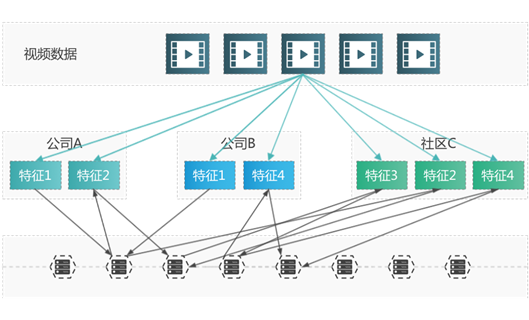

**解决方案** TRIAS安全运维系统使银行无需外流数据，于本地即可执行他行合约程序。同时，将运行结果在链上共享，通过整合链上的金融关键信息，建立安全评估模型，最终把“金融大数据”平台搬上区块链。一方面，实现了金融关键数据使用可追溯，让数据的使用张弛有度，既可以被拓宽范围，又可以有效防止滥用；另一方面，使得泄露可追踪，所有的数据使用记录均被有效存储，任何的行为都可以被查证追溯，让滥用泄露信息者不再有心存侥幸，为金融科技及金融大数据相关领域发展做好坚强后盾。

**应用场景** 金融机构是大数据天生的合作者，一方面自身有着利用技术红利带来收益冲动，另一方面又有国内较好的信息化基础。因此金融大数据发展也促进了金融行业从多方面实现管理的转型和业务产品的创新，其中包括信用风险、客户服务、智能运营以及金融本身的产品。

### 5.3.2.	医疗大数据

**痛点描述** 医疗数据的记录存储使用，涉及到每个人生命的全周期、生活的全方位，医疗大数据的构建跟使用是真正的“大”数据。建立健全大数据，保护运营好大数据，不仅能创造价值、带来健康，也将助力健康产业成为下一个国民经济支柱产业。

然而，收益与挑战并存，大数据的使用同时也给数据的收集录入、多部门共享处理、多终端多用户使用带来巨大的安全与运维挑战。

**解决方案** 结合TRIAS统，构建大型可信大数据共享平台，为上层应用实现安全开发、安全智能运维处置。实现在链上汇聚应用系统生命周期的关键信息，并建立安全评估模型，最终把“医疗大数据”平台搬上区块链；让数据来源可查，使用可追溯，泄露可追踪，为健康大数据的建立运营保驾护航。

**应用场景** 当前，医疗健康正在成为人们关注的重点问题，以智能化、数字化为特征的医疗信息化浪潮也在蓬勃兴起，健康医疗大数据作为国家重要的基础性战略资源，受到了政府、医院、企业等行业相关人员的高度重视。

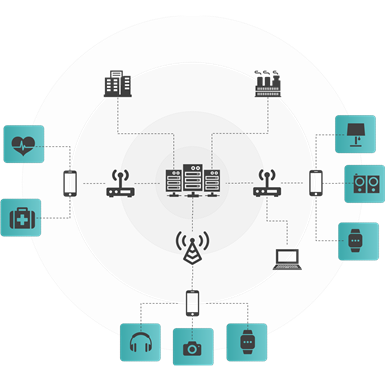

### 5.3.3.	政务云平台

**痛点描述** 对于政务云的建设来讲，安全防泄露是其不可忽视的重要一环。随着云计算、虚拟化、大数据等新兴技术在政务体系建设中的应用，传统的安全机制被打破。

**解决方案** 基于云安全的合规要求缺失、虚拟化中的通信流量不可见、虚拟化本身以及数据共享带来新的安全风险成为了政务云当前面临的挑战。这要求政务云要具有防御全新安全威胁的能力。同时，运营维护中的操作使用及权限管理监控，以及事件中的及时响应处置，事件后的追责查证，也都是合格政务云系统应该具备的素质。构建于TRIAS上的云系统可有效满足政务系统特殊性要求，提升安全防护与运维查证的能力。


**应用场景** 电子政务中引入云计算技术与服务，可充分利用云计算成本低、可靠性及灵活性高的特点来提升电子政务的应用效能。《中华人民共和国国民经济和社会发展第十二个五年规划纲要》中明确指出要“大力推进国家电子政务建设，加强云计算服务平台建设，构建下一代信息基础设施”、“建设完善电子政务公共平台，全面提升电子政务技术服务能力”。
## 5.4.	志愿者数据矿场

随着万物互联时代的到来，智能设备、可联网硬件的普及，基于网络连接、传感器数据收集，配合云端的设备管理、大数据分析等技术的融合，创造出大量的应用创新而形成的庞大多种类数据库。IOT概念自诞生以来，就一直受到了资本和行业巨头的追捧，无论是中国的BAT，还是世界巨头谷歌、亚马逊、特斯拉，都早早开始了物联网布局。典型如传统的汽车产业巨头奔驰、宝马，基于单体车辆或者型号车辆间的数据互联互通汇总，将使得技术和应用的不断融合和积累，必将使得汽车行业的经营维护模式带来巨大的转变。

大数据人工智能时代，每个人数据的产生者，同时也是数据的使用者，更应该是大数据的受益者。新商业共享模式要建立在数据的充分准确获取与真实有效流通。在这个发展过程中，越来越多经营实体加入到这个围绕着数据完整生命周期服务的链条中，并且互相之间将形成越来越密切的关系。传统的基于单点采集整理，面临着庞大的开拓成本与接入门槛，如何能让数据提供方、获取方、使用者均能获得收益，在商业上已经不存在模型上的门槛，但对于技术落地，却可以依赖区块链技术，使得商业模式真正实现。所有人通过万物互联产生的数据都可以通过区块链的智能合约进行可信交互和共享，而为数据更进一步的价值提升使用，可以通过区块链的激励机制来增加大家的积极的贡献自己的闲时算力和数据价值分享，让全网加入数据分享和加速的区块链红利中。

### 5.4.1.	PC/智能电视/机顶盒端志愿者计算

**痛点描述** 目前针对数据内容的实时分析和价值提取效果并不理想，最大的问题就是数据内容如视频单像素点信息内容不够，需要大量实时的相关像素点关联分析才能提取有价值的信息，当前主流的价值视频呈现超高清的态势，比如4K、2K等。这样的数据密度情况下，如果要实现实时有价值的人工智能分析与挖掘，需要建立高额成本的算力平台，因此，很难达到一个算力平台的投入产出红利状态。

**解决方案** 通过区块链的激励机制，把所有播放视频内容的设备如PC/智能电视/机顶盒等直接数据源接入到区块链中，这样不但保证了视频内容每一个像素的真实和透明性，另一方面也可让所有的终端共享自己的闲时算力。利用这些算力来完成视频内容的有价值分析和分享，分析出来的内容越多，贡献的算力越强，所获得激励越高。这样最终可以实现全网的基于区块链视频内容的自愿者计算共享。

<div align=center>
  
</div>
<div align=center>图 21 用TRIAS实现视频内容分析志愿者算力网络</div>

**应用场景** 自尼尔森于 1950 年开始测量电视观众以来，电视和我们看电视的方式已经发生了巨大的变化。今天，我们能够随时在多种设备上观看我们喜爱的节目，这使得我们更加迫切地需要具备极其灵活的收视调研能力。随着技术不断发展，媒体公司不断尝试用新的方式来吸引观众，了解消费者看什么和他们使用的收看设备比以往任何时候都更加重要。显然，从真正掌握真实数据开始，后面一系列的更加精准、更匹配用户、大数据分析等都会逐渐浮出水面。真实数据的使用，才刚刚打开冰山一角。

### 5.4.2.	智慧交通志愿者计算

**痛点描述** “行”做为人类最基本的需求之一，会产生海量数据，而如何利用这些数据服务于社会，是智慧交通要解决的问题。虽然当前智慧交通还处于较初级阶段，但随着产业前景被看好，在投入增多的情况下，科技的力量也在渗入智慧交通的各个角落。在数据收集层，传感器和激光技术不断突破，能够被获取的出行数据越来越多，在传输层，移动信号传输标准早已确立，并且传输速度也呈线性增长，另一方面，处理这些数据需要大量算力，这些算力用来执行一些算法来为应用层提供数据支持，比如做为一个交通流控的决策依据。而这些算力无论让政府还是企业承担显然都是高昂的投入。

**解决方案** TRIAS在这个场景下可以做为一个可信算力提供平台，它将零散的用户算力进行整合，在安全可信的节点上提供高效的运算，并利用经济激励机制，对可信度高、算力强大的节点给予经济奖励，而对那些恶意篡改数据、提供不实算力的节点给予惩罚。 因此，TRIAS不仅避免了节点算力的浪费，而且有效降低政府企业成本，杜绝中心化算力被控制的可能。

<div align=center>
  
</div>
<div align=center>图 22 用TRIAS实现自动驾驶AI训练志愿者算力平台</div>

**应用场景** 像Uber、滴滴这样的企业都会有交通拥堵分析的业务，这样的业务需要很精确的数据从而分析结果，比如拥堵路段、行进速度、拥堵原因等。这种场景就依赖很多参与者的数据，比如高架桥上的摄像头数据、车辆的传感器数据、用户上传的事故图片数据等，这些数据可以通过传输层交给TRIAS算力平台处理，平台会运行应用商比如滴滴发布的合约去运算数据，算力提供者响应运算请求并获得奖励，输出分析结果供滴滴使用。

### 5.4.3.	可穿戴设备与智能家居

**痛点描述** 可穿戴设备智能家居及个人医疗设备都对人类的健康指数、行为习惯、生活偏好和工作履历痕迹等数据的完整性、准确性、全面性要求颇高。同时有由于保有庞大的个人隐私数据，成为了信息防护的重点区域。

**解决方案** TRIAS实现了个人为可穿戴设备AI、智能家居和社区AI、个人医疗健康AI训练，贡献数据并提供算力的可能。由于数据及算力提供者可从链上获得一定收益，相关行为的活跃程度得以保证。同时，TRIAS可信、可追溯的属性保证可穿戴设备、智能家居、个人医疗健康相关隐私数据在供AI训练的过程中不被泄露和破坏。

**应用场景** 伴随人工智能的发展，人类更加依赖于可穿戴设备和智能家居带来的便利。可穿戴设备、智能家居、个人医疗健康设备、智慧社区等的深度学习都依赖于庞大而精准的数据支撑。AI+数据的良性循环对可穿戴设备及智能家行业的发展是至关重要的。从而帮助相关AI+数据良性循坏，提高训练的效率及质量，打造真正智能的、安全可信的可穿戴设备+智能家居+智慧社区生态系统。

<div align=center>
  
</div>
<div align=center>图 23 用TRIAS实现智慧社区</div>

# 6.	Token经济体系

TRIAS用三方面的Token激励机制，实现了对Leviatom网络的可信算力节点、Prometh框架的安全验证节点、以及MagCarta合约的开发者的激励。

首先，在Leviatom网络里，第一层算力节点通过不断验证周围节点（一到三层）的TEE可信状态，挖掘第三层算力节点并用持续高频的重复验证，确保目标节点始终处于可信的状态。第一层算力节点是构成Leviatom网络的基础，尤其在网络初建期，第一层节点的规模与活跃度将决定网络的健壮性。因此，第一层节点将有可能通过此类“安全验证即挖矿”挖掘出新的Token。第二层算力节点实现了对全网算力可信性的汇总、传递、和路由。它们也将会因为此贡献获得Token奖励。第三层节点执行MagCarta分发的应用程序，若结果正确，将有机会获得MagCarta Call所定义的奖励Token。由于第三层节点的执行权是由第一、第二层节点通过贡献运算、存储、带宽获得，第三层节点将把所得的部分Token用于主动奖励参与挖矿或传播的那些节点。

Prometh应用程序为了实现可溯源与自动化安全分析，也需要号召社区的力量，通过贡献算力、安全验证程序等，为程序的安全性背书。因此在Prometh体系构建的初期，也需要利用挖矿机制，实现对志愿者的激励。具体而言，即允许开发者或安全分析人员在对软件源码（或中间态的二进制文件）实施安全验证的自动化分析、测试程序时，能有机会获得新生成的Token。

同时，由于Prometh无法保障复杂的原生应用绝无漏洞（但其强审计+溯源体系可确保所有漏洞均可在有限时间内被发掘，并实现追责），它可以将一部分收入化为保险，存入保险池。保险池可用来奖励在Prometh里发现某个程序漏洞的安全分析程序，并可用于赔偿因为运行了有漏洞的程序而遭受损失的节点。保险模型主要面向数据与算力提供方，该方可在获得收益的同时，可选择将部分收益转为保险，以弥补未被及时发现的漏洞对本地数据或算力平台带来的安全风险。保险Token基金同时可以用于作为漏洞发现者的奖励，进而构造出一套良性循环的网络空间安全生态。

最后，MagCarta合约在其Consensus调用中通过制定PRICE_STRATEGY实现了对Leviatom算力与Prometh程序的付费。此交易方式将成为挖矿结束后的主要Token流转驱动力。

更为详尽的TRIAS生态Token经济模型，Token分配模型等将在Token经济模型白皮书中做详尽阐述。

# 7.	团队介绍

## 7.1.	核心团队

**阮安邦，CEO 八分量创始人&CEO，** 牛津大学计算机博士、博士后，北京大学计算机硕士。前牛津大学OeRC研究中心研究员，在可信计算、可信云平台、云计算安全以及虚拟化平台安全领域拥有十余年研究累计。曾参与包括FP7欧盟重大项目在内的多个可信云、可信大数据平台方向项目。负责解决可信计算在云计算、大数据平台中有效性、高效性及可扩展性问题。并担任国际顶级期刊JACM可信云方向审稿人。已发表IEEE Transactions论文两篇，国际学术会议论文二十余篇。

**魏 明，CTO 八分量联合创始人&CTO，** 北京大学博士、硕士。前中国航天软件研发中心高级架构师，西门子研究院工程师。多年的团队软件开发与管理经验，涉及云计算、人工智能、嵌入式等多个领域。在八分量其间主持开发了自主可控的DASO私链&联盟链与持续免疫系统的安全架构，能实现区块链10万TPS的数据存证安全应用场景要求。国内外论文约十余篇，专利十余项。

**孙家昊，CSO**  英国伦敦某国际银行人工智能总工程师。牛津大学计算机系毕业。受英国政府认证并引进的人工智能方向精英人才。在英国伦敦先后创业多家公司，并在AI与FinTech领域获得欧洲顶级投资机构投资。同时，他还是网易、稀牛学院、七月在线等人工智能与深度学习在线课程的金牌讲师。

**郝	爽，CMO 八分量公关总监，** 香港浸会大学传媒管理硕士。曾任央媒一线记者，参与重大国际新闻报道。曾供职于清华大学、网易负责战略传播及公共事务。

**陈	健，社区建设 八分量市场总监，** 曾就职于网易游戏、网易有道、奇虎360等公司。10年市场营销经历，负责及参与网易游戏、有道搜索、有道词典、360手机卫士等互联网产品的市场营销工作。

**尹朝明，Leviatom核心算法设计** 阿里巴巴EB级大数据平台高级工程师，获得佐治亚理工学院计算机博士，北京大学硕士学位，在美国硅谷甲骨文公司，英特尔研究院有多年图计算，分布式系统全球研发经验。在ACM SIGMOD等杂志/会议上发表论文多篇，Google scholar引用170多篇。

**闫	坤，Leviatom核心开发 Linux内核开发者、区块链开发者。** LTP、EOS、Eosjs社区代码贡献者。就职中科院软件所时担任核高基课题CDOS的核心开发者。曾参与HP ContainerOS项目的核心开发工作,ContainerOS是在操作系统模块容器化的尝试，主要负责内核模块IMA对Container的度量，借助TEE技术增强系统容器和应用容器的安全性。曾为Intel Kernel Production Team 在Android平台上LTP项目的移植贡献核心代码。具有丰富的Bitcoin、Ethereum和Hyperledger相关项目的落地经验。

**陈凯，Leviatom核心开发 八分量后端高级开发工程师，** 中国科技大学硕士。曾就职于中国航天和用友集团。具备丰富的服务高并发开发经验，曾经开发的NIO系统在用友集团实现了百万级TPS访问的混合商务管理平台，并且成功申请相关专利。在八分量工作阶段，具备丰富的可信计算开发经验，主力开发了完全自主可控的TPM可信计算服务平台，并且参与了DASO私链&联盟链的核心开发，具备丰富的Ethereum和EOS相关项目的落地经验。

**王佳帅，Leviatom核心开发 八分量后端技术经理。** 曾就职于华为、中国航天、搜房金融集团。对于在移动互联网金融、大数据、高并发web server，区块链领域都有深入的开发应用经验。在搜房网负责了金融P2P 产品天下贷的核心开发，涉及从账号安全、高并发、数据一致性等互金产品的全生命周期。在航天期间负责某卫星项目的知识图谱的专家诊断系统研发与上线。八分量工作期间参与了DASO 私链&联盟链底层区块链共识通讯与数字资产的研发与优化，使其能达到10万TPS的吞吐量。并且熟悉Bitcoin、Ethereum和Hyperledger等主流区块链的钱包与账号实现方式，完成了DASO的自主可控的带资产主权的区块链账号系统。

**果	霖，Prometh核心开发 八分量运维开发总监，** 曾是滴滴出行高级运维开发工程师，带领团队完成滴滴100多个业务项目的devops自动化上线发布与测试。主要负责容器化设计和实施以及DEVOPS架构及落地，对业务如何与BigchainDB、Ethereum、Hyperledger、EOS等区块链技术结合有深入研究。

**李	飞，Prometh核心开发 八分量运维实施总监，** 前飞信系统结构师，主导海外RCS移动互联网的通讯项目，曾设计了O2O平台到家美食会的系统及存储架构，精于研究互联网技术，善于异构中间件环境，优化海量数据下系统存储和应用，经手系统承载过超600万同时在线的使用，TPS过千万量级。
## 7.2.	核心合作单位

**北京八分量信息科技有限公司（八分量）**

八分量将为TRIAS项目提供全面完善的技术研发与市场推广的支持。八分量核心团队成员以牛津大学和北京大学为主，成员多来自 Intel、微软、阿里、滴滴等大型移动互联网企业，具备丰富的科技创新和实践经验。八分量是国内最早引入可信计算和区块链技术相结合的安全解决方案提供商，已在银行、证券、政务云等多个重大项目中落地成功，获得良好的社会与经济效应。独创的DASO私链&联盟链+持续免疫系统的数据中心安全解决方案，从根本上解决了企业用户数据恶意行为的防御需求，在2017年的勒索病毒事件中实现0安全事故。结合用户实际业务应用场景优化打造出的区块链数据中心可实现10万TPS吞吐量。

**北大软微-八分量协同创新实验室（简称实验室）**

实验室将依托八分量，为TRIAS项目提供TEE、图计算、可信软件构建等方面的科研创新力量。实验室是由北京大学软件与微电子学院与八分量联合共建，旨在通过校企联合，实现可信计算、信誉系统、区块链等可信赖技术的创新研发与产业落地。

**牛津大学网络空间安全中心-八分量可信赖计算研究所（筹）（简称研究所）**

在筹建中的研究所将依托八分量，为TRIAS项目提供TEE、网络空间安全、经济学、政治哲学等多方面综合科研创新力量。牛津大学网络空间安全中心的网络空间安全博士培养项目（CDT）由Andrew Martin教授创立并领导，目前CDT共计近80位在读网络空间安全博士生。Andrew Martin教授，在可信计算领域（如Intel SGX, TCG TPM等）拥有国际权威，对可信计算生态巨头（Intel, IBM, Microsoft, HP等）的研发、商务团队也有重要的影响力。
 
# 8.	路线图

**2009 Q4,**	 SCOA论文发表，首次提出可信软件构建体系，为Prometh奠定理论基础；

**2011 Q4,** RepCloud论文发表，首次提出基于图算法的可信证实协议，与Gossip协议，为Leviatom与HCGraph奠定理论基础；

**2016 Q2,** 基于三权分立模型的OpenStack可信服务在英国公有云公司100%IT落地；

**2016 Q2,** 与牛津大学、100%IT在欧洲最大的云计算博览会发布可信OpenStack服务；

**2016 Q4,** SoP论文发表，首次提出基于三权分立模型的可信云基础架构，为TRIAS奠定理论基础；

**2017 Q2,** 在贵阳大数据博览会云计算与大数据安全高峰论坛，首次提出可信计算+图算法+区块链的共识协议设计思路，并指出有望实现高效（10万级TPS）、稳定（对抗90%算力攻击）、以及通用（兼容x86应用程序）的区块链共识；

**2017 Q3,** 北大软微-八分量协同创新实验室在北大挂牌成立，首次发布异构共识区块链的设计理念和技术路线，提出了异构共识图的三层算力模型；

**2017 Q4,** 基于Leviatom私链模式的关键数据防篡改产品在银行、券商落地；

**2018 Q1,** 基于Prometh+Leviatom私链的企业数据中心DevSecOps体系在券商落地；

**2018 Q2,** TRIAS可行性分析，项目启动 & 团队组建；

**2018 Q3, 技术白皮书发布。** Leviatom方案正式版，异构共识图开发、可信算力开发、账号开发、异构交易开发、形式化验证、压力测试及 TPS 数据发布；

**2018 Q4, 测试网上线。** 代码开源；基础网络、激励机制、钱包等技术方案发布；

**2019 Q1,** 测试&迭代。可信计算算力网络、边缘计算方案实现与联合调试，测试安全性和弹性扩展迭代，全球压力测试、安全测试；

**2019 Q2, 主网1.0上线。** 发布钱包 & 区块浏览器。发布Prometh与MagCarta工具集。

# 附录：已发表论文

Leviatom：

[1] RepCloud: Attesting to Cloud Service Dependency 

**Anbang Ruan** and Andrew Martin. In IEEE Transactions on Services Computing

[2] NeuronVisor: Defining a Fine-grained Cloud Root-of-Trust 

**Anbang Ruan** and Andrew Martin. In Proceedings of The 6th International Conference on Trustworthy Systems (InTrust 2014). Dec, 2014.

[3] RepCloud: Achieving Fine-grained Cloud TCB Attestation with Reputation Systems

**Anbang Ruan,** Andrew Martin. Proceeding of STC’11 The Sixth ACM Workshop on Scalable Trusted Computing. Chicago, IL, USA, Oct. 2011.

Prometh：

[4] Towards a Source-Code Oriented Attestation

**Anbang Ruan,** Qingni Shen, Liang Gu, Li Wang, Yahui Yang, Zhong Chen, China Communications, Nov. 2009. Vol.6 No.4, pp: 82-87. SCI-Indexed.

[5] SCOBA: source code based attestation on custom software

Liang Gu, Yao Guo, **Anbang Ruan,** Qingni Shen, Hong Mei. In Proceedings of ACSAC10: Texas, USA

[6] Practical Property-based Attestation on Free Software 

Liang Gu, **Anbang Ruan,** Yao Guo, Qingni Shen, Xiangqun Chen. Poster session of ACSAC09, Nov 2009.

Trias Politica （Seperation-of-Powers）：

[7] A Separation-of-Powers Model for a Trustworthy and Open Cloud Computing Ecosystem 

**Anbang Ruan.** Dphil (PhD) Thesis at University of Oxford.

[8] Breaking Down the Monarchy: Achieving Trustworthy and Open Cloud Ecosystem Governance with Separation-of-Powers

**Anbang Ruan,** Ming Wei, Andrew P. Martin, David Blundell, David Wallom. In Proceeding of IEEE CLOUD 2016. San Francisco, CA, USA

[9] On the Feasibility of an Open-Implementation Cloud Infrastructure: A Game Theoretic Analysis

Charles A. Kamhoua, **Anbang Ruan,** Andrew P. Martin, Kevin A. Kwiat. UCC 2015: Limassol, Cyprus
